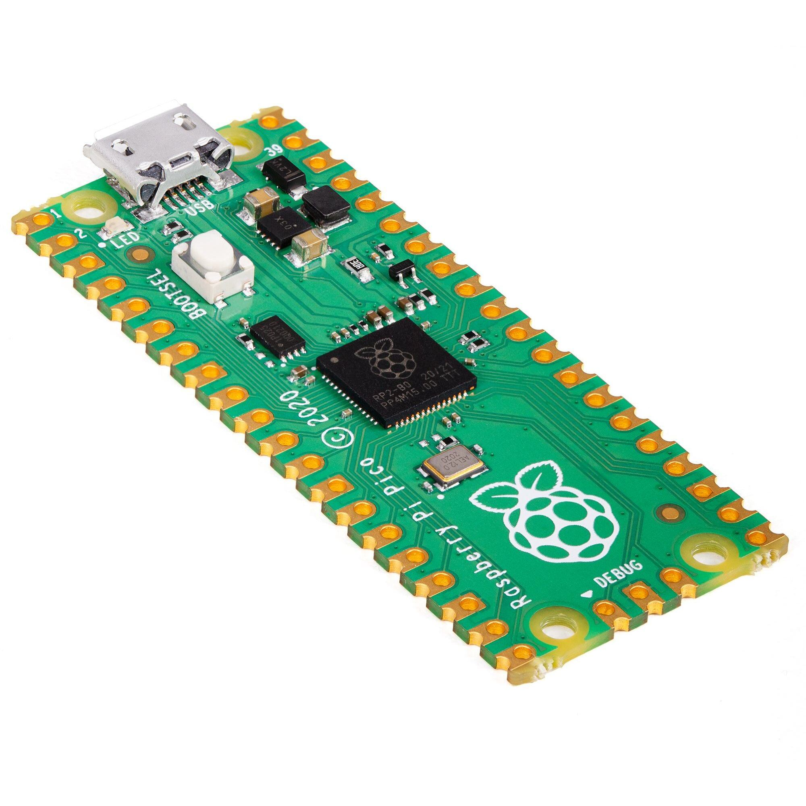

# Introduction

  

The PicoMite is a Raspberry Pi Pico running the MMBasic interpreter.
MMBasic is a Microsoft BASIC compatible implementation of the BASIC
language with floating point, integer and string variables, arrays, long
variable names, a built in program editor and many other features.
Using MMBasic you can control the I/O pins and use communications
protocols such as I2C or SPI to get data from a variety of sensors. You can
display data on low-cost colour LCD displays, measure voltages, detect
digital inputs and drive output pins to turn on lights, relays, etc.

The PicoMite firmware is totally free to download and use.

 

The emphasis with MMBasic is on ease of use and development. The development cycle is very fast with the
ability to instantly switch from edit to run. Errors are listed in plain English and when an error does occur a
single keystroke will invoke the built-in editor with the cursor positioned on the line that caused the error.

In summary the features of the PicoMite are:

- **The BASIC interpreter is full featured** with floating point, 64-bit integers and string variables, long
  variable names, arrays of floats, integers or strings with multiple dimensions, extensive string handling
  and user defined subroutines and functions. Typically, it will execute a program up to 100,000 lines per
  second. MMBasic allows the embedding of compiled C programs for high performance functions and
  the running program can be protected from being listed or modified by a PIN number.

- **Support for all Raspberry Pi Pico input/output pins.** These can be independently configured as
  digital input or output, analog input, frequency or period measurement and counting. Within MMBasic
  the I/O pins can be dynamically configured as inputs or outputs. MMBasic commands will generate
  pulses and can be used to transfer data in parallel. Interrupts can be used to notify when an input pin has
  changed state. PWM outputs can be used to create various sounds, control servos or generate computercontrolled voltages for driving equipment that uses an analogue input (e.g. motor controllers). In
  addition, pins that are not exposed on the Raspberry Pi Pico can be accessed using MMBasic allowing it
  to be used on other modules that use the RP2040 processor.

- **Support for TFT LCD display** panels using parallel, SPI and I2C interfaces allowing the BASIC program to display text and draw lines, circles, boxes, etc in up to 16 million colours. Resistive touch
  controllers on these panels are also supported allowing them to be used as sophisticated input devices.
  LCD panels can cost as little as US$7 and provide a low cost, high tech graphical user interface. For
  higher speed and greater resolution parallel interface TFT screens are also supported.

- **Flexible program and data storage.** Programs and data can be read/written from an internal file system
  (approx 688KB) or to an externally connected SD Card up to 32GB formatted as FAT16 or FAT32. This
  includes opening files for reading, writing or random access and loading and saving programs. The SD
  Card can also be read/written on personal computers running Windows, Linux or the Mac operating system.

- **Programming and control is done via the USB interface.** All that is needed is a laptop/desktop
  computer running a VT100 terminal emulator. Once the program has been written and debugged the
  PicoMite can be instructed to automatically run the program on power up with no user intervention.

- **A full screen editor** is built into the PicoMite and can edit the whole program in one session. It includes
  advanced features such as colour coded syntax, search and copy, cut and paste to and from a clipboard.

- **Programs can be easily transferred** from a desktop or laptop computer (Windows, Mac or Linux) using
  the XModem protocol or by streaming the program over the serial console input.

- **A comprehensive range of communications protocols** are implemented including I2C, asynchronous
  serial, RS232, SPI and 1-Wire. These can be used to communicate with many sensors (temperature,
  humidity, acceleration, etc) as well as for sending data to test equipment.

- **The PicoMite has built in commands** to directly interface with infrared remote controls, the DS18B20
  temperature sensor, LCD display modules, battery backed clock, numeric keypads and more.

- **Power requirements are 2.0 to 5.5 volts** at 10 to 42 mA.
