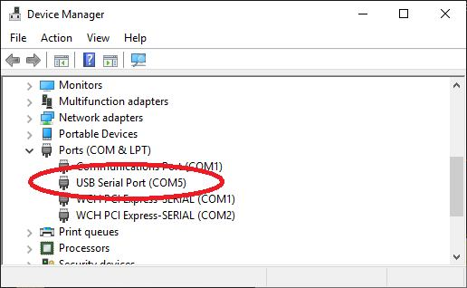

# Getting Started

## Loading the PicoMite Firmware

The Raspberry Pi Pico comes with its own built in firmware loader that is easy to use. Just follow these steps:

* Download the PicoMite firmware from http://geoffg.net/picomite.html and unzip the file. Identify the
firmware which should be named something like “PicoMiteV5.xx.xx.uf2”.

* Using a USB cable plug the Raspberry Pi Pico into your computer (Windows, Linux or Mac) while
holding down the white BOOTSEL button on the Raspberry Pi Pico.

* The Raspberry Pi Pico should connect to your computer and create a virtual drive (the same as if you had
plugged in a USB memory stick) called “RPI-RP2”. This drive will contain two files which you can
ignore.

* Copy the firmware file (with the extension .uf2) to this virtual drive.

* When the copy has completed the Raspberry Pi Pico will restart and create a virtual serial port on your
computer. The LED on the Raspberry Pi Pico will blink slowly indicating that the PicoMite firmware
with MMBasic is now running.

While the virtual drive created by the Raspberry Pi Pico looks like a USB memory stick it is not, the firmware
file will vanish once copied and if you try copying any other type of file it will be ignored.
Loading the PicoMite firmware will erase the flash memory including the current program, any programs saved
in flash memory slots and all saved variables. So make sure that you backup this data before you upgrade the
firmware.

It is possible for the flash memory to be corrupted resulting in unusual and unpredictable behaviour. In that
case you should load the firmware file https://geoffg.net/Downloads/picomite/Clear_Flash.uf2 which will reset
the Raspberry Pi Pico to its factory fresh state, then you can reload the PicoMite firmware.

## Virtual Serial Port

<div style="float: right; margin-right: 20px;">
  
</div>

The virtual serial port created by the PicoMite firmware acts
like a normal serial port but it operates over USB.

Windows 10 includes a driver for this virtual serial port but
with other versions you may have to load a driver to make it
work with the operating system (see below).

Once this is done you should note the port number created by
your computer for the virtual serial connection. In Windows
this can be done by starting Device Manager and checking the
"Ports (COM & LPT)" entry for a new COM port as shown on
the right.

<br style="clear:both" />

# Terminal Emulator

You also need a terminal emulator program on your desktop computer. This program acts like an old fashioned
computer terminal where it will display text received from a remote computer and any key presses will be sent
to the remote computer over the serial link. The terminal emulator that you use should support VT100
emulation as that is what the editor built into the PicoMite expects.

For Windows users it is recommended that you use Tera Term as this has a good VT100 emulator and is known
to work with the XModem protocol which you can use to transfer
programs to and from the PicoMite (Tera Term can be downloaded from:
http://tera-term.en.lo4d.com ).

<div style="float: right; margin-right: 20px;">
  
</div>

The screen shot on the right shows the setup for Tera Term. Note that the
"Port:" setting will vary depending on which USB port your Raspberry Pi
Pico was plugged into. The PicoMite ignores the baud rate setting so it can
be set to any speed (other than 1200 baud which puts the Pico into
firmware upgrade mode).

If you are using Tera Term do not set a delay between characters and if
you are using Putty set the backspace key to generate the backspace
character.

<br style="clear:both" />

## The Console

Once you have identified the virtual serial port and
have connected your terminal emulator to it you
should be able to press return on your keyboard and
see the MMBasic prompt, which is the greater than
symbol (e.g. `>` ).

This is the console and you use it to issue
commands to configure the PicoMite, load the
BASIC program, edit and run it. MMBasic also
uses the console to display error messages.

The console is the only method of communicating
with the PicoMite and programming it, so it is
important that you can connect to it.

## Some Tests

Here are a few things that you can try out to prove that you have a working PicoMite.
All of these commands should be typed at the command prompt (`>`).

Try a simple calculation:
```basic
> PRINT 1/7
0.1428571429
```

See how much memory you have:
```basic
> MEMORY
Program:
0K ( 0%) Program (0 lines)
80K (100%) Free
RAM:
0K ( 0%) 0 Variables
0K ( 0%) General
112K (100%) Free
```

What is the current time? Note that the PicoMite's clock starts at midnight on power up.
```basic
> PRINT TIME$
00:04:01
```

Set the clock to the current time:
```basic
> TIME$ = "10:45"
```

Check the time again:
```basic
> PRINT TIME$
10:45:09
```

How many milliseconds have elapsed since power up:
```basic
> PRINT TIMER
440782 .748
```

Count to 20:
```vbnet
> FOR a = 1 to 20 : PRINT a; : NEXT a
1 2 3 4 5 6 7 8 9 10 11 12 13 14 15 16 17 18 19 20
```

## Windows 7 and 8.1

The USB serial port uses the CDC protocol and the drivers for this are standard in Windows 10 and 11 and will
load automatically.

The Raspberry Pi Foundation lists Windows 7 or 8.1 as “unsupported” however you can use a tool like Zadig
( https://zadig.akeo.ie ) to install a generic driver for a `usbser` device and that should allow these computers to
connect. This post describes the process: https://github.com/raspberrypi/pico-feedback/issues/118


## Apple Macintosh

The Apple Macintosh (OS X) is somewhat easier as it has the device driver and terminal emulator built in.
First start the application ‘Terminal’ and at the prompt list the connected serial devices by typing in:
```sh
ls /dev/tty.*.
```
The USB to serial converter will be listed as something like `/dev/tty.usbmodem12345`. While still at the
Terminal prompt you can run the terminal emulator at 38400 baud by using the command:
```sh
screen /dev/tty.usbmodem12345 38400
```

By default the function keys will not be correctly defined for use in the PicoMite's built in program editor so
you will have to use the control sequences as defined in the section Full Screen Editor of this manual. To avoid
this you can reconfigure the terminal emulator to generate these codes when the appropriate function keys are
pressed.

Documentation for the screen command is here: https://www.systutorials.com/docs/linux/man/1-screen/


## Linux
For Linux see these posts:
* https://www.thebackshed.com/forum/ViewTopic.php?TID=14157&PID=175474#175474#175466
* https://www.thebackshed.com/forum/ViewTopic.php?FID=16&TID=16312&LastEntry=Y#213664#213594


## Android
For Android devices see this post:
* https://www.thebackshed.com/forum/ViewTopic.php?TID=16312&PID=213594#213594#213594
