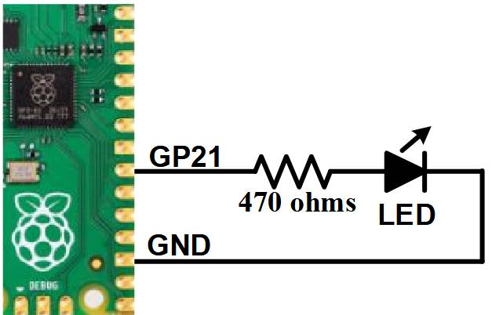

# Quick Start Tutorial

## A Simple Program

To enter a program, you can use the EDIT command which is described later in this manual. However, for the moment, all that you need to know is that anything that you type will be inserted at the cursor, the arrow keys will move the cursor and backspace will delete the character before the cursor.

To get a quick feel for how the PicoMite works, try this sequence (your terminal emulator must be *VT100* compatible):

* At the command prompt type `EDIT` followed by the **ENTER** key.

The editor should start up and you can enter this line: `PRINT "Hello World"`

Press the **F1** key in your terminal emulator (or **CTRL-Q** which will do the same thing). This tells the
editor to save your program and exit to the command prompt.

At the command prompt type RUN followed by the **ENTER** key.

You should see the message: `Hello World`

Congratulations. You have just written and run your first program on the PicoMite. If you type `EDIT` again you will be back in the editor where you can change or add to your program.

## Flashing a LED

<div style="float: right; margin-right: 20px;">
  | - GND" width="250">
</div>

Connect a LED to pin *GP21* (marked on the underside of the board) and a ground pin as shown in the diagram on the right.

Then use the EDIT command to enter the following program:

```basic
SETPIN GP21, DOUT
DO
PIN(GP21) = 1
PAUSE 300
PIN(GP21) = 0
PAUSE 300
LOOP
```

When you have saved and run this program you should be greeted by the LED flashing on and off. It is not a great program but it does illustrate how the PicoMite can interface to the physical world via your programming.

<br style="clear:both" />

The program itself is simple. The first line sets pin *GP21* as an output. Then the program enters a continuous loop where the output of that pin is set high to turn on the LED followed by a short pause (300 milliseconds).

The output is then set to low followed by another pause. The program then repeats the loop.

If you leave it this way, the PicoMite will sit there forever with the LED flashing. If you want to change something (for example, the speed of flashing) you can interrupt the program by typing **CTRL-C** on the console and then edit it as needed. This is the great benefit of MMBasic, it is very easy to write and change a program.

If you want this program to automatically start running every time power is applied you can use the command:

```basic
OPTION AUTORUN ON
```

To test this you can remove the power and then re-apply it. The PicoMite should start up flashing the LED.

## Tutorial on Programming in the BASIC Language

If you are new to the BASIC programming language now would be a good time to turn to [Appendix G – Programming in BASIC - A Tutorial](G_programming_in_basic_a_tutorial.md) at the rear of this manual. This is a comprehensive tutorial on the language which will take you through the fundamentals in an easy to read format with lots of examples.
