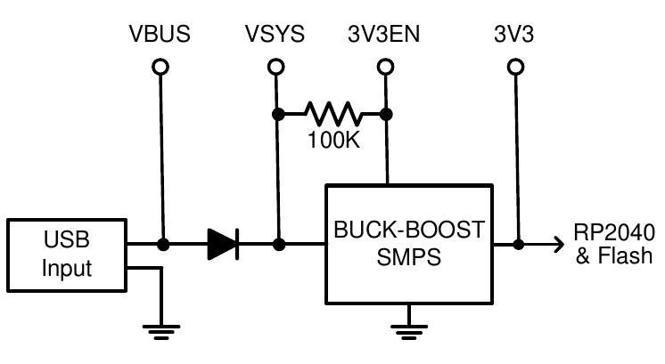

# PicoMite Hardware

This diagram shows the possible uses within MMBasic for each I/O pin on the Raspberry Pi Pico:
PWM0A COM1 TX I2C SDA
PWM0B COM1 RX I2C SCL
PWM1A
PWM1B
PWM2A COM2 TX
PWM2B COM2 RX
PWM3A
PWM3B
PWM4A COM2 TX
PWM4B COM2 RX
PWM5A
PWM5B
PWM6A COM1 TX
PWM6B COM1 RX
PWM7A
PWM7B

SPI RX

GP0
1
GP1
2
GND
I2C2 SDA SPI CLK GP2
4
I2C2 SCL SPI TX
GP3
5
I2C SDA SPI RX
GP4
6
I2C SCL
GP5
7
GND
I2C2 SDA SPI CLK GP6
9
I2C2 SCL SPI TX
GP7 10
I2C SDA SPI2 RX GP8 11
I2C SCL
GP9 12
GND
I2C2 SDA SPI2 CLK GP10 14
I2C2 SCL SPI2 TX
GP11 15
I2C SDA SPI2 RX GP12 16
I2C SCL
GP13 17
GND
I2C2 SDA SPI2 CLK GP14 19
I2C2 SCL SPI2 TX
GP15 20

VREF
ADC2
AGND
ADC1
ADC0

VBUS
VSYS
GND
3V3EN
3V3
ADC VREF
34 GP28 SPI2 RX I2C SDA COM1 TX
GND
32 GP27 SPI2 TX I2C2 SCL
31 GP26 SPI2 CLK I2C2 SDA
RUN
29 GP22
I2C2 SDA
GND
27 GP21
I2C SCL COM2 RX
26 GP20 SPI RX I2C SDA COM2 TX
25 GP19 SPI TX I2C2 SCL
24 GP18 SPI CLK I2C2 SDA
GND
22 GP17
I2C SCL COM1 RX
21 GP16 SPI RX I2C SDA COM1 TX

PWM6A
PWM5B
PWM5A
PWM3A
PWM2B
PWM2A
PWM1B
PWM1A
PWM0B
PWM0A

For versions with VGA video output six pins (GP16 to GP21) are reserved for that function. Similarly HDMI
versions have eight pins (GP12 to GP19) that are reserved for that function. Refer to the chapter titled Video Output for more information.

The version of the firmware with USB keyboard/mouse support also reserves pin 11 (GP8) for the serial
console Tx and pin 12 (GP9) for Rx. Refer to the chapter Keyboard/Mouse/Ganepad for more information.

The notation is as follows:
- GP0 to GP28 : Can be used for digital input or output.
- COM1, COM2 : Can be used for asynchronous serial I/O (UART0 and UART1 pins on the Pico datasheet).
- I2C, I2C2 : Can be used for I2C communications (I2C0 and I2C1 pins on the Pico datasheet).
- SPI, SPI2 : Can be used for SPI I/O (see Appendix D). (SPI0 and SPI1 pins on the Pico datasheet).
- PWMnx : Can be used for PWM output (see the PWM command).
- GND : Common ground.
- VBUS : 5V supply directly from the USB port.
- VSYS : 5V supply used by the SMPS to provide 3.3V. This can be used as a 5V output or input.
- 3V3EN : Enable 3.3V regulator (low = off, high = enabled).
- RUN : Reset pin, low will hold the PicoMite in reset.
- ADCn : These pins can be used to measure voltage (analog input).
- ADC VREF : Reference voltage for voltage measurement.
- AGND : Analog ground.

All pins can be used for digital input or output however they are limited to a maximum voltage of 3.6V. This means that level shifting will be required if they are used with devices operating at 5V or higher.

Within the MMBasic program I/O pins can be referred to using the physical pin number (i.e. 1 to 40) or the GP number (i.e. GP0 to GP28). For example, the following refer to the same pin and operate identically:

```
SETPIN 32, DOUT
```

and

```
SETPIN GP27, DOUT
```

On the PicoMite on-chip functions such as the SPI and I2C interfaces are not allocated to fixed pins, unlike (for example) the Micromite. The PicoMite makes extensive use of the SETPIN command, not only to configure
I/O pins but also to configure the pins used for interfaces such as serial, SPI, I2C, etc.

Pins must be allocated according to this drawing. For example, the SPI TX can be allocated to pins GP3, GP7
or GP19 but it cannot be allocated to pin GP11 which can only be allocated to the SPI2 channel. Allocations
don't have to be in the same "block" so you could, for example, allocate SPI2 TX to pin GP11 and SPI2 RX to pin GP28.

## Third Party Modules

Pins that are not exposed on the Raspberry Pi Pico can still be accessed using MMBasic via a pseudo pin number or their GPn number. This allows MMBasic to be used on other modules that use the RP2040 processor. These hidden pins are Pin 41 or GP23, Pin 42 or GP24, Pin 43 or GP25 and Pin 44 or GP29.

On the Raspberry Pi Pico these pins are used for internal functions as follows:

* Pin 41 or GP23 is a digital output set to the value of OPTION POWER. (ON=PWM, OFF=PFM).
* Pin 42 or GP24 is a digital input, which is high when VBUS is present.
* Pin 43 or GP25 is also PWM4B. It is an output connected to the on-board LED.
* Pin 44 or GP29 is also ADC3 which is an analog input reading ⅓ of VSYS.

However on third party modules that make them available they can be used as follows:

* Pin 41 or GP23: DIGITAL_IN: DIGITAL_OUT, SPI TX, I2C2 SCL, PWM3B
* Pin 42 or GP24: DIGITAL_IN: DIGITAL_OUT, SPI2 RX, COM2 TX, I2C SDA, PWM4A
* Pin 43 or GP25: DIGITAL_IN: DIGITAL_OUT, COM2 RX, I2C SCL, PWM4B
* Pin 44 or GP29: DIGITAL_IN: DIGITAL_OUT, ANALOG_IN, COM1 RX, I2C SCL, PWM6B


## WebMite version for the Raspberry Pi Pico W or Pico 2 W

The WebMite version also has some GPIO pins which are used for internal board functions:

* GP29 (Input/Output) wireless SPI CLK/ADC mode (ADC3) measures VSYS/3
* GP25 SPI CS (Output) when high also enables GPIO29 ADC pin to read VSYS
* GP24 (Input/Output) wireless SPI data / IRQ
* GP23 (Output) wireless power-on signal

The WebMite firmware does not allow these pins to be re-allocated.

Unlike the standard Raspberry Pi Pico, the on-board LED on the Pico W is not connected to a pin on the
RP2040, but instead to a GPIO pin on the wireless chip and cannot be accessed from a BASIC program.

The antenna is on the PCB at the opposite end to the USB connector and should be kept in free space for best
performance – don’t put metal under or close by the antenna.

## New CPU Variations

The newer chips released by the Raspberry Pi Foundation and supported by the PicoMite are:

### RP2350A

This is packaged in a 60 pin package and is used in the Raspberry Pi Pico 2 and many other third party
modules. The pinouts and functions of the I/O pins are the same as the RP2040 and are documented above.

### RP2350B

The RP2350B is in a 80 pin package with an additional 18 GPIO pins. The PicoMite firmware supports these
additional pins including PWM channels 8-11 (allows for a maximum of 24 simultaneous PWM outputs).

Configuration for the RP2350B is done automatically making all the additional pins and three PIO channels
available (the VGA version has two free PIO channels). Pin definitions for the RP2350B should use the GP
nomenclature (ie, GP0 to GP47). Pins GP40 to GP47 can be used for analogue input, pins GP26-GP29 do not
support analogue input.

Pin usage for pins GP0 to GP29 on the RP2350B are the same as that used for the RP2040 and RP2350A. Pins
GP30 to GP47 can be used as follows:

- GP30: DIGITAL_IN: DIGITAL_OUT, SPI2 SCK, I2C2 SDA, PWM7A
- GP31: DIGITAL_IN: DIGITAL_OUT, SPI2 TX, I2C2 SCL, PWM7B
- GP32: DIGITAL_IN: DIGITAL_OUT, COM1 TX, SPI RX, I2C SDA, EXT_PWM8A
- GP33: DIGITAL_IN: DIGITAL_OUT, COM1 RX, I2C SCL, PWM8B
- GP34: DIGITAL_IN: DIGITAL_OUT, SPI SCK, I2C2 SDA, PWM9A
PicoMite User Manual Page 13
- GP35: DIGITAL_IN: DIGITAL_OUT, SPI TX, I2C2 SCL, PWM9B
- GP36: DIGITAL_IN: DIGITAL_OUT, COM2 TX, SPI RX, I2C SDA, PWM10A
- GP37: DIGITAL_IN: DIGITAL_OUT, COM2 RX, I2C SCL, PWM10B
- GP38: DIGITAL_IN: DIGITAL_OUT, SPI SCK, I2C2 SDA, PWM11A
- GP39: DIGITAL_IN: DIGITAL_OUT, SPI TX, I2C2 SCL, PWM11B
- GP40: DIGITAL_IN: DIGITAL_OUT, ANALOG_IN, COM2 TX, SPI2 RX, I2C SDA, PWM8A
- GP41: DIGITAL_IN: DIGITAL_OUT, ANALOG_IN, COM2 RX, I2C SCL, PWM8B
- GP42: DIGITAL_IN: DIGITAL_OUT, ANALOG_IN, SPI2 SCK, I2C2 SDA, PWM9A
- GP43: DIGITAL_IN: DIGITAL_OUT, ANALOG_IN, SPI2 TX, I2C2 SCL, PWM9B
- GP44: DIGITAL_IN: DIGITAL_OUT, COM1TX, ANALOG_IN, SPI2 RX, I2C SDA, PWM10A
- GP45: DIGITAL_IN: DIGITAL_OUT, COM1RX, ANALOG_IN, I2C SCL, PWM10B
- GP46: DIGITAL_IN: DIGITAL_OUT, ANALOG_IN, SPI2 SCK, I2C2 SDA, PWM11A
- GP47: DIGITAL_IN: DIGITAL_OUT, ANALOG_IN, SPI2 TX, I2C2 SCL, PWM11B

### RP2354A and RP2354B

These are currently not supported by the PicoMite firmware.

## PSRAM

The RP2350 supports PSRAM and some commercial offerings have added 8MB of PSRAM to boards with the
80-pin RP2350B (eg, Pimoroni PGA2350).

The PSRAM is accessed via a Quad SPI bus so it is comparatively slow although it is buffered via a cache
which mitigates that issue. If PSRAM is present and configured MMBasic will add it to the general purpose
RAM pool so programs will have an enormous amount of general RAM to work with, even though it may be a
little slower.

To access any PSRAM an additional pin is needed for the chip select function and this is selected using the
OPTION PSRAM PIN command. Valid pins for the PSRAM chip select are GP0, GP8, GP19 and GP47.


## I/O Pin Limits

The maximum voltage that can be applied to any I/O pin is 3.6V.

As outputs all I/O pins can individually source or sink a maximum of 12mA. At this load the output voltage
will sag to about 2.3V. A more practical load is 5mA where the output voltage would typically be 3V. To drive a red LED at 5mA the recommended resistor is 220Ω. Other colours may require a different value.

The maximum total I/O current load for the entire chip is 50mA.

## Power Supply

<div style="float: right; margin-right: 20px;">
  
</div>

The Raspberry Pi Pico has a flexible power system.

The input voltage from either the USB or VBUS inputs is connected through a Schottky diode to the buck-boost SMPS (Switch Mode Power Supply) which has an output of 3.3V. The SMPS will accommodate input voltages from 1.8V to 5.5V allowing the PicoMite to run from a wide range of power sources including batteries.


External circuitry can be powered by VBUS (normally 5V) or by the 3V3 (3.3V) output which can source up to 300mA.

<br style="clear:both" />

For embedded controller applications generally an external power source (other than USB) is required and this
can be connected to VSYS via a Schottky diode. This will allow the PicoMite to be powered by whichever
supply is producing the highest voltage (USB or VSYS). The diodes will prevent feedback into the lower
voltage supply.

To minimize power supply noise it is possible to ground 3V3EN to turn off the SMPS. When shutdown the
converter will stop switching, internal control circuitry will be turned off and the load disconnected. You can then power the board via a 3.3V linear regulator feeding into the 3V3 pin.

## Clock Speed

By default the clock speed for the RP2040 used in the Raspberry Pi Pico is 200MHz and for the RP2350 used
in the Raspberry Pi Pico 2 is 150MHz. These are the recommended maximums.

Using the OPTION CPUSPEED command, most RP2040 CPUs can be overclocked up to 420MHz or 396MHz
for the RP2350 (PicoMite and WebMite only). They can also run slower to a minimum of 48MHz. This option
is saved and will be reapplied on power up. When changing the clock speed the PicoMite firmware will be
reset then rebooted so the USB connection will be disconnected.

Versions with Video @ 640x400 resolution have the clock set to 252MHz however this can be changed using
OPTION RESOLUTION to 252MHz, 315MHz or 378MHz.

At other video resolutions the clock speed is fixed at 283.2MHz, 324MHz, 360MHz ,372MHz or 375MHz
depending on the video resolution selected and this cannot be changed.

Nearly all tested Raspberry Pi Picos have worked correctly at 380MHz or more, so overclocking can be useful.
If the processor fails to restart at its new clock speed you can reset it by loading Clear_flash.uf2 to reset the Pico to its factory fresh state.

## Power Consumption

The power consumption is dependent on the clock speed, however at the default clock speed (200MHz for the
RP2040 and 150MHz for the RP2350), the typical power consumption is 25mA. This does not include any
current sourced or sunk by the I/O pins or the 3V3 pin:

The power consumption for the WebMite version for the Raspberry Pi Pico W is the same at 20mA with the
WiFi disabled but, when the WiFi is enabled, the power consumption will rise to 40 to 70mA.

