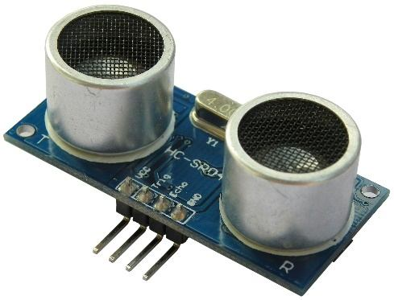

## Measuring Distance

<div style="float: right; margin-left: 20px;">
  <br>
</div>

Using a HC-SR04 ultrasonic sensor and the DISTANCE() function you can measure the distance to a target.

This device can be found on eBay for about US$4 and it will measure the distance to a target from 3cm to 3m. It works by sending an ultrasonic sound pulse and measuring the time it takes for the echo to be returned.

Compatible sensors are the SRF05, SRF06, Parallax PING and the DYPME007 (which is waterproof and therefore good for monitoring the level of a water tank). Others that have been reported as working well use the CS100 chip - such as the HC-SR04 and US-025.

In the PicoMite firmware you use the DISTANCE function as follows:

```basic
d = DISTANCE(trig, echo)
```

The value returned is the distance in centimetres to the target.

Where trig is the I/O pin connected to the "trig" input of the sensor and echo is the pin connected the "echo" output of the sensor. You can also use 3-pin devices and in that case only one pin number is specified.

Note that the maximum voltage on all the Raspberry Pi Pico’s I/O pins is 3.3V. Level shifting will be required for this sensor because it uses 5V levels for its echo output. The Raspberry Pi Pico 2 can tolerate 5V (while powered) so, in this case, level shifting is not required.<br style="clear:both" />


