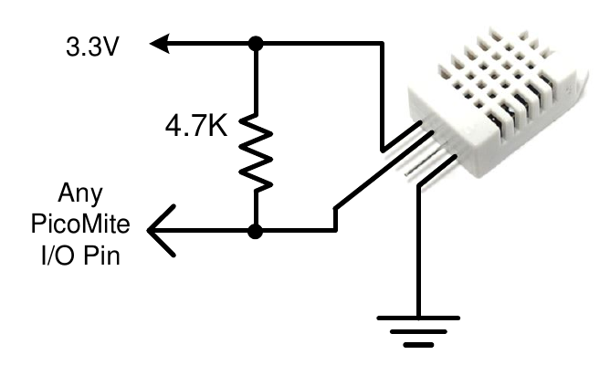

## Measuring Humidity and Temperature

<div style="float: right; margin-left: 20px;">
  <br>
</div>

The HUMID command will read the humidity and temperature from a DHT22 humidity/temperature sensor. This device is also sold as the RHT03 or AM2302 but all are compatible and can be purchased on eBay for under $5. The DHT11 sensor is also supported.

The DHT22 must be powered from 3.3V (or up to 5V with the Raspberry Pi Pico 2) and it should have a pullup resistor on the data line as shown. This is suitable for long cable runs (up to 20 meters) but for short runs the resistor can be omitted as the PicoMite firmware also provides an internal weak pullup.

To get the temperature or humidity you use the HUMID command with three arguments as follows:
HUMID pin, tVar, hVar [,DHT11]

Where `pin` is the I/O pin to which the sensor is connected. The I/O pin will be automatically configured by MMBasic.

`tVar` is a floating point variable in which the temperature is returned and `hVar` is a second variable for the humidity. The temperature is returned as degrees C with a resolution of one decimal place (eg, 23.4) and the humidity is returned as a percentage relative humidity (eg, 54.3).

If the optional `DHT11` parameter is set to 1 then the command will use device timings suitable for that device.

In this case the results will be returned with a resolution of 1 degree and 1% humidity This example demonstrates using the DHT22 to display the current temperature and humidity every second:

```basic
DIM FLOAT temp, humidity
DO
  HUMID GP15, temp, humidity
  PRINT "The temperature is" temp " and the humidity is" humidity
  PAUSE 1000 
LOOP
```
<br style="clear:both" />

