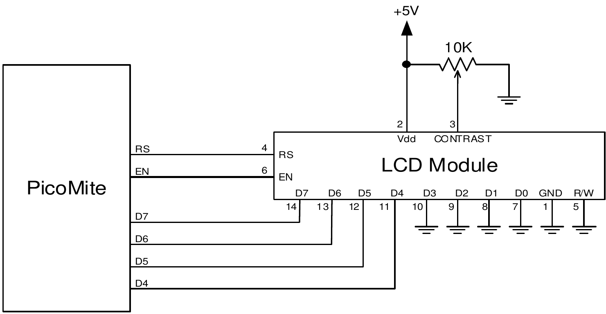

## LCD Display

<div style="float: right; margin-left: 20px;">
  <br>
</div>


The LCD command will display text on a standard LCD module with the minimum of programming effort.

This command will work with LCD modules that use the KS0066, HD44780 or SPLC780 controller chip and have 1, 2 or 4 lines. Typical displays include the LCD16X2 (futurlec.com), the Z7001 (altronics.com.au) and the QP5512 (jaycar.com.au). eBay is another good source where prices can range from $10 to $50.

To setup the display you use the DEVICE LCD INIT command `LCD INIT d4, d5, d6, d7, rs, en`

`d4`, `d5`, `d6` and `d7` are the numbers of the I/O pins that connect to inputs D4, D5, D6 and D7 on the LCD module (inputs D0 to D3 and R/W on the module should be connected to ground). `rs` is the pin connected to the register select input on the module (sometimes called CMD or DAT). `en` is the pin connected to the enable or chip select input on the module.

Any I/O pins on the Raspberry Pi Pico can be used and you do not have to set them up beforehand (the LCD command automatically does that for you). The following shows a typical set up.

<div style="clear: both; margin: .5em 15%;">

</div>

To display characters on the module you use the LCD command
`LCD line, pos, data$`

Where `line` is the line on the display (1 to 4) and `pos` is the position on the line where the data is to be written (the first position on the line is 1). `data$` is a string containing the data to write to the LCD display.

The characters in `data$` will overwrite whatever was on that part of the LCD.

The following shows a typical usage where d4 to d7 are connected to pins GP2 to GP5, rs is connected to pin GP6 and en to pin GP7.

```basic
LCD INIT GP2, GP3, GP4, GP5, GP6, GP7
LCD 1, 2, "Temperature"
LCD 2, 6, STR$(TEMPR(GP15)) ' DS18B20 connected to pin GP15
```

Note that this example also uses the TEMPR() function to get the temperature (described above).

