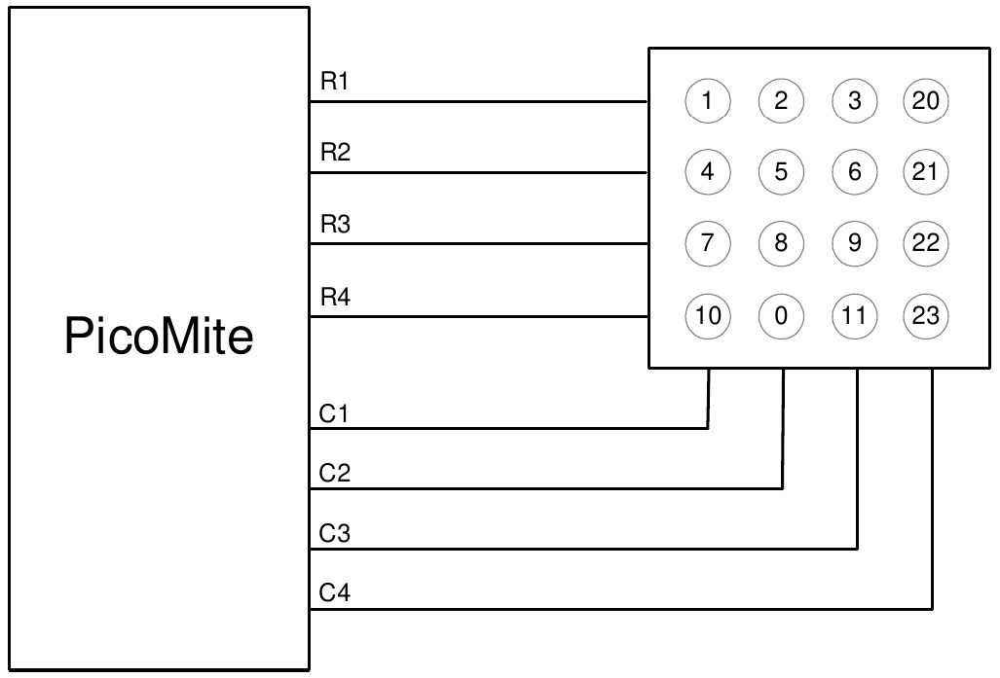

## Keypad Interface

A keypad is a low tech but effective method of entering numeric data. The PicoMite firmware supports either a 4x3 keypad or a 4x4 keypad and the monitoring and decoding of key presses is done in the background. When a key press is detected an interrupt will be issued where the program can deal with it.

Examples of a 4x3 keypad and a 4x4 keypad are the Altronics S5381 and S5383 (go to https://www.altronics.com ).

To enable the keypad feature you use the command `KEYPAD var, int, r1, r2, r3, r4, c1, c2, c3, c4`

Where `var` is a variable that will be updated with the key code and `int` is the name of the interrupt subroutine to call when a new key press has been detected. `r1`, `r2`, `r3` and `r4` are the pin numbers used for the four row connections to the keypad (see the diagram below) and `c1`, `c2`, `c3` and `c4` are the column connections. `c4` is only used with 4x4 keypads and should be omitted if you are using a 4x3 keypad.

Any I/O pins on the Raspberry Pi Pico can be used and you do not have to set them up beforehand, the KEYPAD command will automatically do that for you.

<div style="clear: both; margin: .5em 25%;">

</div>

The detection and decoding of key presses is done in the background and the program will continue after this command without interruption. When a key press is detected the value of the variable var will be set to the number representing the key (this is the number inside the circles in the diagram above). Then the interrupt will be called.

For example:
```basic
Keypad KeyCode,KP_Int,GP2,GP3,GP4,GP5,GP6,GP7,GP8 ' 4x3 keybd
DO
< body of the program >
LOOP

SUB KP_Int           ' run when a key press has been detected
  PRINT "Key press = " KeyCode  
END SUB
```


