## Character Set

Picomite uses an ASCII compatible character encoding.

### Non-Printable ASCII characters (character code 0-31)

The first 32 characters in the ASCII-table are unprintable control codes and are used to control peripherals such as printers.

Int | HEX | Symbol |  Description                    | Font1
:-: | :-: | :-: | :-                                 | :-
00 | 00 | `NUL` | Null character, empty, not printable   | &nbsp;
01 | 01	| `SOH` |  Start of Heading                  |  
02 | 02	| `STX` |  Start of Text                     |  
03 | 03	| `ETX` |  End of Text                       |  
04 | 04	| `EOT` |  End of Transmission               |  
05 | 05	| `ENQ` |  Enquiry                           |  
06 | 06	| `ACK` |  Acknowledge                       |  
07 | 07	| `BEL` |  Bell, Alert                       | 
08 | 08	| `BS`  |  Backspace                         |  
09 | 09	| `HT`  |  Horizontal Tab                    |  
10 | 0A	| `LF`  |  Line Feed                         |  
11 | 0B	| `VT`  |  Vertical Tabulation               |  
12 | 0C	| `FF`  |  Form Feed                         |  
13 | 0D	| `CR`  |  Carriage Return                   |  
14 | 0E	| `SO`  |  Shift Out                         |  
15 | 0F	| `SI`  |  Shift In                          | 
16 | 10	| `DLE` |  Data Link Escape                  |  
17 | 11	| `DC1` |  Device Control One (XON)          |  
18 | 12	| `DC2` |  Device Control Two                |  
19 | 13	| `DC3` |  Device Control Three (XOFF)       |  
20 | 14	| `DC4` |  Device Control Four               |  
21 | 15	| `NAK` |  Negative Acknowledge              |  
22 | 16	| `SYN` |  Synchronous Idle                  |  
23 | 17	| `ETB` |  End of Transmission Block         | 
24 | 18	| `CAN` |  Cancel                            |  
25 | 19	| `EM`  |  End of medium                     |  
26 | 1A	| `SUB` |  Substitute                        |  
27 | 1B	| `ESC` |  Escape                            |  
28 | 1C	| `FS`  |  File Separator                    |  
29 | 1D	| `GS`  |  Group Separator                   |  
30 | 1E | `RS`  |  Record Separator                  |  
31 | 1F	| `US`  |  Unit Separator                    | 

### Printable ASCII characters

Codes 32-127 are common for all the different variations of the ASCII table, they are called printable characters, represent letters, digits, punctuation marks, and a few miscellaneous symbols. You will find almost every character on your keyboard. 

Character 127 should represent the command `DEL`. 

Int | HEX | Symbol |  Description                    | Font1
:-: | :-: | :-: | :-                                 | :-
32  | 20 |	SP  |  Space                                   |   
33  | 21 |	!   |  Exclamation mark                        |  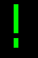 
34  | 22 |	"   |  Double quotes (or speech marks)         |  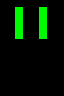 
35  | 23 |	#   |  Number sign                             |  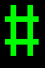 
36  | 24 |	$   |  Dollar                                  |   
37  | 25 |	%   |  Per cent sign                           |   
38  | 26 |	&   |  Ampersand                               |  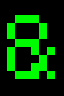 
39  | 27 |	'   |  Single quote                            |  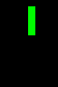
40  | 28 |	(   |  Open parenthesis (or open bracket)      |   
41  | 29 |	)   |  Close parenthesis (or close bracket)    |   
42  | 2A |	*   |  Asterisk                                |   
43  | 2B |	+   |  Plus                                    |   
44  | 2C |	,   |  Comma                                   |   
45  | 2D |	-   |  Hyphen-minus                            |   
46  | 2E |	.   |  Period, dot or full stop                |   
47  | 2F |	/   |  Slash or divide                         |  
48  | 30 |	0   |  Zero                                    |   
49  | 31 |	1   |  One                                     |   
50  | 32 |	2   |  Two                                     |  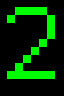 
51  | 33 |	3   |  Three                                   |   
52  | 34 |	4   |  Four                                    |   
53  | 35 |	5   |  Five                                    |   
54  | 36 |	6   |  Six                                     |   
55  | 37 |	7   |  Seven                                   |  
56  | 38 |	8   |  Eight                                   |   
57  | 39 |	9   |  Nine                                    |  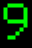 
58  | 3A |	:   |  Colon                                   |   
59  | 3B |	;   |  Semicolon                               |   
60  | 3C |	<   |  Less than (or open angled bracket)      |   
61  | 3D |	=   |  Equals                                  |   
62  | 3E |	>   |  Greater than (or close angled bracket)  |   
63  | 3F |	?   |  Question mark                           |  
64  | 40 |	@   |  At sign                                 |   
65  | 41 |	A   |  Uppercase A                             |  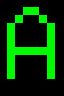 
66  | 42 |	B   |  Uppercase B                             |   
67  | 43 |	C   |  Uppercase C                             |  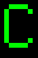 
68  | 44 |	D   |  Uppercase D                             |   
69  | 45 |	E   |  Uppercase E                             |   
70  | 46 |	F   |  Uppercase F                             |   
71  | 47 |	G   |  Uppercase G                             |  
72  | 48 |	H   |  Uppercase H                             |   
73  | 49 |	I   |  Uppercase I                             |   
74  | 4A |	J   |  Uppercase J                             |   
75  | 4B |	K   |  Uppercase K                             |   
76  | 4C |	L   |  Uppercase L                             |   
77  | 4D |	M   |  Uppercase M                             |   
78  | 4E |	N   |  Uppercase N                             |  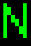 
79  | 4F |	O   |  Uppercase O                             |  
80  | 50 |	P   |  Uppercase P                             |   
81  | 51 |	Q   |  Uppercase Q                             |   
82  | 52 |	R   |  Uppercase R                             |   
83  | 53 |	S   |  Uppercase S                             |   
84  | 54 |	T   |  Uppercase T                             |   
85  | 55 |	U   |  Uppercase U                             |   
86  | 56 |	V   |  Uppercase V                             |   
87  | 57 |	W   |  Uppercase W                             |  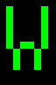
88  | 58 |	X   |  Uppercase X                             |   
89  | 59 |	Y   |  Uppercase Y                             |   
90  | 5A |	Z   |  Uppercase Z                             |   
91  | 5B |	[   |  Opening bracket                         |  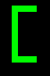 
92  | 5C |	\   |  Backslash                               |   
93  | 5D |	]   |  Closing bracket                         |  ![\]](font1/5D.png) 
94  | 5E |	^   |  Caret - circumflex                      |   
95  | 5F |	_   |  Underscore                              |  
96  | 60 |	`   |  Grave accent                            |   
97  | 61 |	a   |  Lowercase a                             |  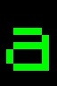 
98  | 62 |	b   |  Lowercase b                             |   
99  | 63 |	c   |  Lowercase c                             |  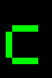 
100  | 64 |	d   |  Lowercase d                             |   
101  | 65 |	e   |  Lowercase e                             |   
102  | 66 |	f   |  Lowercase f                             |  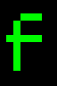 
103  | 67 |	g   |  Lowercase g                             |  
104  | 68 |	h   |  Lowercase h                             |   
105  | 69 |	i   |  Lowercase i                             |  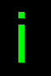 
106  | 6A |	j   |  Lowercase j                             |  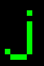 
107  | 6B |	k   |  Lowercase k                             |  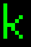 
108  | 6C |	l   |  Lowercase l                             |   
109  | 6D |	m   |  Lowercase m                             |   
110  | 6E |	n   |  Lowercase n                             |   
111  | 6F |	o   |  Lowercase o                             |  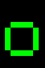
112  | 70 |	p   |  Lowercase p                             |   
113  | 71 |	q   |  Lowercase q                             |   
114  | 72 |	r   |  Lowercase r                             |   
115  | 73 |	s   |  Lowercase s                             |   
116  | 74 |	t   |  Lowercase t                             |   
117  | 75 |	u   |  Lowercase u                             |   
118  | 76 |	v   |  Lowercase v                             |   
119  | 77 |	w   |  Lowercase w                             |  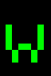
120  | 78 |	x   |  Lowercase x                             |   
121  | 79 |	y   |  Lowercase y                             |   
122  | 7A |	z   |  Lowercase z                             |  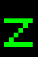 
123  | 7B |	{   |  Opening brace                           |   
124  | 7C |	|   |  Vertical bar                            |   
125  | 7D |	}   |  Closing brace                           |   
126  | 7E |	~   |  Equivalency sign - tilde                |   
127  | 7F |	&nbsp; | &nbsp;                                  |  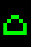

### Symbols

Fonts 1 and 4 have an extended character set. The symbols are not from the ASCII standard, some are not even in Unicode (as of 2025)

Int | Symbol | Font 1
:-: | :-:    | :-
128 | &nbsp; |  
129 |        | 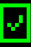 
130 |        |  
131 |        |  
132 |        |  
133 |        |  
134 |        |  
135 |        | 
136 |        |  
137 |        |  
138 |        |  
139 |        |  
140 |        |  
141 |        | 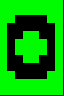 
142 |        | 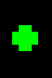 
143 |        | 
144 |        |  
145 |        |  
146 |        |  
147 |        |  
148 |        |  
149 |        |  
150 |        |  
151 |        | 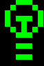
152 |        |  
153 |        |  
154 |        |  
155 |        |  
156 |        |  
157 |        | 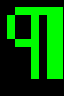 
158 |        |  
159 |        | 
160 |        |  
161 |        |  
162 |        |  
163 |        | 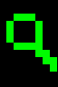 
164 |        |  
165 |        |  
166 |        |  
167 |        | 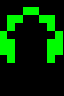
168 |        | 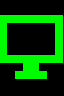 
169 |        |  
170 |        |  
171 |        |  
172 |        |  

#### Borders and UI Elements

Int | Symbol | Font 1
:-: | :-:    | :-
173 |        |  
174 |        |  
175 |        | 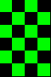
176 |        |  
177 |        |  
178 |        | 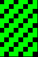 
179 |        | 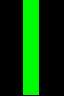 
180 |        |  
181 |        |  
182 |        |  
183 |        | 
184 |        |  
185 |        |  
186 |        | 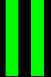 
187 |        |  
188 |        |  
189 |        | 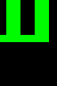 
190 |        |  
191 |        | 
192 |        | 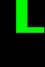 
193 |        |  
194 |        |  
195 |        |  
196 |        |  
197 |        |  
198 |        |  
199 |        | 
200 |        |  
201 |        |  
202 |        |  
203 |        |  
204 |        |  
205 |        |  
206 |        |  
207 |        | 
208 |        |  
209 |        |  
210 |        |  
211 |        |  
212 |        |  
213 |        |  
214 |        |  
215 |        | 
216 |        |  
217 |        |  
218 |        |  
219 |        |  
220 |        |  
221 |        |  
222 |        |  
223 |        | 

#### Math Symbols

Int | Symbol | Font 1
:-: | :-:    | :-
224 |        |  
225 |        |  
226 |        |  
227 |        |  
228 |        |  
229 |        |  
230 |        | 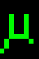 
231 |        | 
232 | &nbsp; | 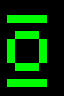 
233 | &nbsp; |  
234 | &nbsp; | 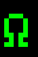 
235 | &nbsp; |  
236 | &nbsp; |  
237 | &nbsp; |  
238 | &nbsp; |  
239 | &nbsp; | 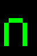
240 | &nbsp; |  
241 | &nbsp; |  
242 | &nbsp; |  
243 | &nbsp; |  
244 | &nbsp; |  
245 | &nbsp; |  
246 | &nbsp; |  
247 | &nbsp; | 
248 | &nbsp; |  
249 | &nbsp; |  
250 | &nbsp; |  
251 | &nbsp; | 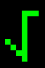 
252 | &nbsp; |  
253 | &nbsp; |  
254 | &nbsp; | 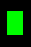 
255 | &nbsp; | 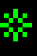