## Character Set

Picomite uses an ASCII compatible character encoding.

### Non-Printable ASCII characters (character code 0-31)

The first 32 characters in the ASCII-table are unprintable control codes and are used to control peripherals such as printers.

Int | HEX | Symbol | Unicode Codepoint | Description
:-: | :-:  | :-:    | :-:                  | :-
00 | 00 | ␀  | U+00000 |  Null character
01 | 01	| ␁  | U+00001 |  Start of Heading
02 | 02	| ␂  | U+00002 |  Start of Text
03 | 03	| ␃  | U+00003 |  End of Text
04 | 04	| ␄  | U+00004 |  End of Transmission
05 | 05	| ␅  | U+00005 |  Enquiry
06 | 06	| ␆  | U+00006 |  Acknowledge
07 | 07	| ␇  | U+00007 |  Bell, Alert
08 | 08	| ␈  | U+00008 |  Backspace
09 | 09	| ␉  | U+00009 |  Horizontal Tab
10 | 0A	| ␊  | U+0000A |  Line Feed
11 | 0B	| ␋  | U+0000B |  Vertical Tabulation
12 | 0C	| ␌  | U+0000C |  Form Feed
13 | 0D	| ␍  | U+0000D |  Carriage Return
14 | 0E	| ␎  | U+0000E |  Shift Out
15 | 0F	| ␏  | U+0000F |  Shift In
16 | 10	| ␐  | U+00010 |  Data Link Escape
17 | 11	| ␑  | U+00011 |  Device Control One (XON)
18 | 12	| ␒  | U+00012 |  Device Control Two
19 | 13	| ␓  | U+00013 |  Device Control Three (XOFF)
20 | 14	| ␔  | U+00014 |  Device Control Four
21 | 15	| ␕  | U+00015 |  Negative Acknowledge
22 | 16	| ␖  | U+00016 |  Synchronous Idle
23 | 17	| ␗  | U+00017 |  End of Transmission Block
24 | 18	| ␘  | U+00018 |  Cancel
25 | 19	| ␙  | U+00019 |  End of medium
26 | 1A	| ␚  | U+0001A |  Substitute
27 | 1B	| ␛  | U+0001B |  Escape
28 | 1C	| ␜  | U+0001C |  File Separator
29 | 1D	| ␝  | U+0001D |  Group Separator
30 | 1E | ␞  | U+0001E |  Record Separator
31 | 1F	| ␟  | U+0001F |  Unit Separator

### Printable ASCII characters

Codes 32-127 are common for all the different variations of the ASCII table, they are called printable characters, represent letters, digits, punctuation marks, and a few miscellaneous symbols. You will find almost every character on your keyboard. 

Int | HEX | Symbol  | Unicode Codepoint |  Description                    | Font1
:-: | :-: | :-: | :-| :-                                 | :-
32  | 20 | `SP` | U+00020   |  Space                                   |   
33  | 21 |	!   | U+00021   |  Exclamation mark                        |   
34  | 22 |	"   | U+00022   |  Double quotes (or speech marks)         |   
35  | 23 |	#   | U+00023   |  Number sign                             |   
36  | 24 |	$   | U+00024   |  Dollar                                  |   
37  | 25 |	%   | U+00025   |  Per cent sign                           |   
38  | 26 |	&   | U+00026   |  Ampersand                               |   
39  | 27 |	'   | U+00027   |  Single quote                            |  
40  | 28 |	(   | U+00028   |  Open parenthesis (or open bracket)      |   
41  | 29 |	)   | U+00029   |  Close parenthesis (or close bracket)    |   
42  | 2A |	*   | U+0002A   |  Asterisk                                |   
43  | 2B |	+   | U+0002B   |  Plus                                    |   
44  | 2C |	,   | U+0002C   |  Comma                                   |   
45  | 2D |	-   | U+0002D   |  Hyphen-minus                            |   
46  | 2E |	.   | U+0002E   |  Period, dot or full stop                |   
47  | 2F |	/   | U+0002F   |  Slash or divide                         |  
48  | 30 |	0   | U+00030   |  Zero                                    |   
49  | 31 |	1   | U+00031   |  One                                     |  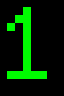 
50  | 32 |	2   | U+00032   |  Two                                     |   
51  | 33 |	3   | U+00033   |  Three                                   |   
52  | 34 |	4   | U+00034   |  Four                                    |  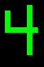 
53  | 35 |	5   | U+00035   |  Five                                    |   
54  | 36 |	6   | U+00036   |  Six                                     |   
55  | 37 |	7   | U+00037   |  Seven                                   |  
56  | 38 |	8   | U+00038   |  Eight                                   |  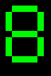 
57  | 39 |	9   | U+00039   |  Nine                                    |   
58  | 3A |	:   | U+0003A   |  Colon                                   |   
59  | 3B |	;   | U+0003B   |  Semicolon                               |  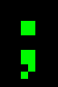 
60  | 3C |	<   | U+0003C   |  Less than (or open angled bracket)      |  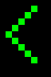 
61  | 3D |	=   | U+0003D   |  Equals                                  |   
62  | 3E |	>   | U+0003E   |  Greater than (or close angled bracket)  |  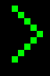 
63  | 3F |	?   | U+0003F   |  Question mark                           |  
64  | 40 |	@   | U+00040   |  At sign                                 |   
65  | 41 |	A   | U+00041   |  Uppercase A                             |   
66  | 42 |	B   | U+00042   |  Uppercase B                             |  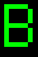 
67  | 43 |	C   | U+00043   |  Uppercase C                             |   
68  | 44 |	D   | U+00044   |  Uppercase D                             |   
69  | 45 |	E   | U+00045   |  Uppercase E                             |   
70  | 46 |	F   | U+00046   |  Uppercase F                             |  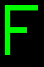 
71  | 47 |	G   | U+00047   |  Uppercase G                             |  
72  | 48 |	H   | U+00048   |  Uppercase H                             |   
73  | 49 |	I   | U+00049   |  Uppercase I                             |   
74  | 4A |	J   | U+0004A   |  Uppercase J                             |   
75  | 4B |	K   | U+0004B   |  Uppercase K                             |  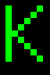 
76  | 4C |	L   | U+0004C   |  Uppercase L                             |   
77  | 4D |	M   | U+0004D   |  Uppercase M                             |   
78  | 4E |	N   | U+0004E   |  Uppercase N                             |   
79  | 4F |	O   | U+0004F   |  Uppercase O                             |  
80  | 50 |	P   | U+00050   |  Uppercase P                             |   
81  | 51 |	Q   | U+00051   |  Uppercase Q                             |  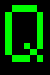 
82  | 52 |	R   | U+00052   |  Uppercase R                             |   
83  | 53 |	S   | U+00053   |  Uppercase S                             |   
84  | 54 |	T   | U+00054   |  Uppercase T                             |  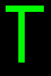 
85  | 55 |	U   | U+00055   |  Uppercase U                             |   
86  | 56 |	V   | U+00056   |  Uppercase V                             |   
87  | 57 |	W   | U+00057   |  Uppercase W                             |  
88  | 58 |	X   | U+00058   |  Uppercase X                             |   
89  | 59 |	Y   | U+00059   |  Uppercase Y                             |   
90  | 5A |	Z   | U+0005A   |  Uppercase Z                             |   
91  | 5B |	[   | U+0005B   |  Opening bracket                         |   
92  | 5C |	\   | U+0005C   |  Backslash                               |  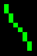 
93  | 5D |	]   | U+0005D   |  Closing bracket                         |  ![\]](font1/5D.png) 
94  | 5E |	\^  | U+0005E   |  Caret - circumflex                      |   
95  | 5F |	_   | U+0005F   |  Underscore                              |  
96  | 60 |	`   | U+00060   |  Grave accent                            |  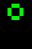 
97  | 61 |	a   | U+00061   |  Lowercase a                             |   
98  | 62 |	b   | U+00062   |  Lowercase b                             |  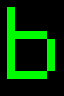 
99  | 63 |	c   | U+00063   |  Lowercase c                             |   
100  | 64 |	d   | U+00064   |  Lowercase d                             |   
101  | 65 |	e   | U+00065   |  Lowercase e                             |   
102  | 66 |	f   | U+00066   |  Lowercase f                             |   
103  | 67 |	g   | U+00067   |  Lowercase g                             |  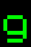
104  | 68 |	h   | U+00068   |  Lowercase h                             |   
105  | 69 |	i   | U+00069   |  Lowercase i                             |   
106  | 6A |	j   | U+0006A   |  Lowercase j                             |   
107  | 6B |	k   | U+0006B   |  Lowercase k                             |   
108  | 6C |	l   | U+0006C   |  Lowercase l                             |   
109  | 6D |	m   | U+0006D   |  Lowercase m                             |   
110  | 6E |	n   | U+0006E   |  Lowercase n                             |  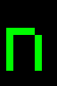 
111  | 6F |	o   | U+0006F   |  Lowercase o                             |  
112  | 70 |	p   | U+00070   |  Lowercase p                             |   
113  | 71 |	q   | U+00071   |  Lowercase q                             |  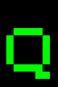 
114  | 72 |	r   | U+00072   |  Lowercase r                             |  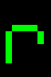 
115  | 73 |	s   | U+00073   |  Lowercase s                             |   
116  | 74 |	t   | U+00074   |  Lowercase t                             |   
117  | 75 |	u   | U+00075   |  Lowercase u                             |   
118  | 76 |	v   | U+00076   |  Lowercase v                             |  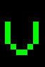 
119  | 77 |	w   | U+00077   |  Lowercase w                             |  
120  | 78 |	x   | U+00078   |  Lowercase x                             |   
121  | 79 |	y   | U+00079   |  Lowercase y                             |   
122  | 7A |	z   | U+0007A   |  Lowercase z                             |   
123  | 7B |	{   | U+0007B   |  Opening brace                           |  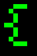 
124  | 7C |	\|  | U+0007C   |  Vertical bar                            |   
125  | 7D |	}   | U+0007D   |  Closing brace                           |  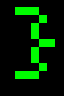 
126  | 7E |	~   | U+0007E   |  Equivalency sign - tilde                |   
127  | 7F |	⌂   | U+2302    |  HOUSE [^127] [^approx]                  |  

[^127]Character 127 should represent the command `DEL`, but is replaced for all fonts on PicoMite.

### Symbols

Fonts 1 and 4 have an extended character set. The symbols are not from the ASCII standard, some are not even in Unicode (as of 2025)

Int | Char | Font 1 | Unicode Codepoint | Description
:-: | :-:  | :-     | :-:                  | :-
128 | ☐ |  | U+2610 | BALLOT BOX 
129 | ☑ |  | U+2611 | BALLOT BOX WITH CHECK
130 | ☒ | 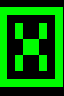 | U+2612 | BALLOT BOX WITH X
131 | ⊡ |  | U+22A1 | SQUARED DOT OPERATOR
132 | ⊟ | 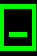 | U+229F | SQUARED MINUS[^approx]
133 | & | 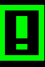 |  | BALLOT BOX WITH EXCLAMATION MARK [^no]
134 | & | 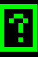 |  | BALLOT BOX WITH QUESTION MARK [^no]
135 | ☻ |  | U+263B | BLACK SMILING FACE
136 | ☺ |  | U+263A | WHITE SMILING FACE
137 | ♦ |  | U+2666 | BLACK DIAMOND SUIT
138 | ♣ | 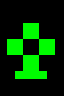 | U+2663 | BLACK CLUB SUIT
139 | ♠ |  | U+2660 | BLACK SPADE SUIT
140 | ♥ |  | U+2665 | BLACK HEART SUIT
141 | ◙ |  | U+25D9 | INVERSE WHITE CIRCLE
142 | ● |  | U+25CF | BLACK CIRCLE
143 | ♪ | 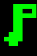 | U+266A | EIGHTH NOTE
144 | ↕ |  | U+2195 | UP DOWN ARROW
145 | ↔ |  | U+2194 | LEFT RIGHT ARROW
146 | ↑ | 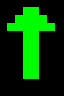 | U+2191 | UPWARDS ARROW
147 | ↓ | 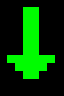 | U+2193 | DOWNWARDS ARROW
148 | → | 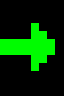 | U+2192 | RIGHTWARDS ARROW
149 | ← |  | U+2190 | LEFTWARDS ARROW
150 | ⏻ |  | U+23FB | POWER SYMBOL
151 | 💡 |  | U+1F4A1 | ELECTRIC LIGHT BULB
152 | 🧍 |  | U+1F9CD | STANDING PERSON
153 |   |  |  | SECURE DIGITAL STORAGE CARD [^no]
154 |   | 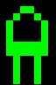 |  | LIGHT-EMITTING DIODE WHITE [^no]
155 |   |  |  | LIGHT-EMITTING DIODE BLACK [^no]
156 | 🔊 | 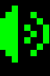 | U+1F50A | SPEAKER WITH THREE SOUND WAVES[^approx]
157 | ¶ |  | U+00B6 | PILCROW SIGN
158 | 🗲 |  | U+1F5F2 | LIGHTNING MOOD[^approx]
159 | ★ | 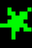 | U+2605 | BLACK STAR
160 | ⏸ |  | U+23F8 | DOUBLE VERTICAL BAR
161 | ⏵ | 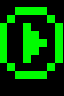 | U+23F5 | BLACK MEDIUM RIGHT-POINTING TRIANGLE
162 | ⏹ |  | U+23F9 | BLACK SQUARE FOR STOP
163 | 🔍 |  | U+1F50D | LEFT-POINTING MAGNIFYING GLASS
164 | € |  | U+20AC | EURO SIGN
165 | 🏠 |  | U+1F3E0 | HOUSE BUILDING
166 | 🗑 | 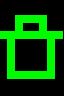 | U+1F5D1 | WASTEBASKET
167 |    |  |  | CIRCLED HEAVY WHITE UPWARDS ARROW [^no]
168 | 🖵 |  | U+1F5B5 | SCREEN
169 | ❗ |  | U+2757 | HEAVY EXCLAMATION MARK SYMBOL
170 | 🌩 |  | U+1F329 | CLOUD WITH LIGHTNING
171 | ᴼᵢ  | 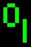 | U+1D3C U+1D62 | MODIFIER LETTER CAPITAL O LATIN SUBSCRIPT SMALL LETTER I[^approx]
172 | 🔑 | 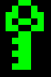 | U+1F511 | KEY

#### Borders and UI Elements
Int | Char | Font 1 | Unicode Codepoint | Description
:-: | :-:  | :-     | :-:                  | :-
173 | 𜱅 |  | U+1CC45 | DENSE HORIZONTAL FILL
174 | 𜱄 |  | U+1CC44 | DENSE VERTICAL FILL
175 | 🮕 |  | U+1FB95 | CHECKER BOARD FILL
176 | 🮘 |  | U+1FB98 | UPPER LEFT TO LOWER RIGHT FILL
177 | ▒ | 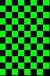 | U+2592  | MEDIUM SHADE
178 | 🮙 |  | U+1FB99 | UPPER RIGHT TO LOWER LEFT FILL
179 | │ |  | U+2502 | BOX DRAWINGS LIGHT VERTICAL
180 | ┤ | 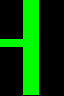 | U+2524 | BOX DRAWINGS LIGHT VERTICAL AND LEFT
181 | ╡ |  | U+2561 | BOX DRAWINGS VERTICAL SINGLE AND LEFT DOUBLE
182 | ╢ | 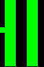 | U+2562 | BOX DRAWINGS VERTICAL DOUBLE AND LEFT SINGLE
183 | ╖ |  | U+2556 | BOX DRAWINGS DOWN DOUBLE AND LEFT SINGLE
184 | ╕ |  | U+2555 | BOX DRAWINGS DOWN SINGLE AND LEFT DOUBLE
185 | ╣ |  | U+2563 | BOX DRAWINGS DOUBLE VERTICAL AND LEFT
186 | ║ |  | U+2551 | BOX DRAWINGS DOUBLE VERTICAL
187 | ╗ |  | U+2557 | BOX DRAWINGS DOUBLE DOWN AND LEFT
188 | ╝ |  | U+255D | BOX DRAWINGS DOUBLE UP AND LEFT
189 | ╜ |  | U+255C | BOX DRAWINGS UP DOUBLE AND LEFT SINGLE
190 | ╛ |  | U+255B | BOX DRAWINGS UP SINGLE AND LEFT DOUBLE
191 | ┐ |  | U+2510 | BOX DRAWINGS LIGHT DOWN AND LEFT
192 | └ |  | U+2514 | BOX DRAWINGS LIGHT UP AND RIGHT
193 | ┴ | 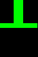 | U+2534 | BOX DRAWINGS LIGHT UP AND HORIZONTAL
194 | ┬ | 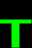 | U+252C | BOX DRAWINGS LIGHT DOWN AND HORIZONTAL
195 | ├ |  | U+251C | BOX DRAWINGS LIGHT VERTICAL AND RIGHT
196 | ─ | 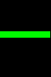 | U+2500 | BOX DRAWINGS LIGHT HORIZONTAL
197 | ┼ | 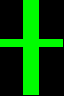 | U+253C | BOX DRAWINGS LIGHT VERTICAL AND HORIZONTAL
198 | ╞ |  | U+255E | BOX DRAWINGS VERTICAL SINGLE AND RIGHT DOUBLE
199 | ╟ |  | U+255F | BOX DRAWINGS VERTICAL DOUBLE AND RIGHT SINGLE
200 | ╚ |  | U+255A | BOX DRAWINGS DOUBLE UP AND RIGHT
201 | ╔ |  | U+2554 | BOX DRAWINGS DOUBLE DOWN AND RIGHT
202 | ╩ |  | U+2569 | BOX DRAWINGS DOUBLE UP AND HORIZONTAL
203 | ╦ | 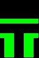 | U+2566 | BOX DRAWINGS DOUBLE DOWN AND HORIZONTAL
204 | ╠ |  | U+2560 | BOX DRAWINGS DOUBLE VERTICAL AND RIGHT
205 | ═ | 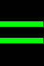 | U+2550 | BOX DRAWINGS DOUBLE HORIZONTAL
206 | ╬ |  | U+256C | BOX DRAWINGS DOUBLE VERTICAL AND HORIZONTAL
207 | ╧ | 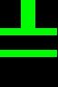 | U+2567 | BOX DRAWINGS UP SINGLE AND HORIZONTAL DOUBLE
208 | ╨ | 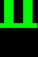 | U+2568 | BOX DRAWINGS UP DOUBLE AND HORIZONTAL SINGLE
209 | ╤ |  | U+2564 | BOX DRAWINGS DOWN SINGLE AND HORIZONTAL DOUBLE
210 | ╥ |  | U+2565 | BOX DRAWINGS DOWN DOUBLE AND HORIZONTAL SINGLE
211 | ╙ |  | U+2559 | BOX DRAWINGS UP DOUBLE AND RIGHT SINGLE
212 | ╘ | 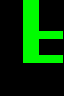 | U+2558 | BOX DRAWINGS UP SINGLE AND RIGHT DOUBLE
213 | ╒ |  | U+2552 | BOX DRAWINGS DOWN SINGLE AND RIGHT DOUBLE
214 | ╓ |  | U+2553 | BOX DRAWINGS DOWN DOUBLE AND RIGHT SINGLE
215 | ╫ | 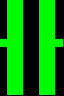 | U+256B | BOX DRAWINGS VERTICAL DOUBLE AND HORIZONTAL SINGLE
216 | ╪ |  | U+256A | BOX DRAWINGS VERTICAL SINGLE AND HORIZONTAL DOUBLE
217 | ┘ |  | U+2518 | BOX DRAWINGS LIGHT UP AND LEFT
218 | ┌ |  | U+250C | BOX DRAWINGS LIGHT DOWN AND RIGHT
219 | █ |  | U+2588 | FULL BLOCK
220 | ▄ |  | U+2584 | LOWER HALF BLOCK
221 | ▌ |  | U+258C | LEFT HALF BLOCK
222 | ▐ |  | U+2590 | RIGHT HALF BLOCK
223 | ▀ |  | U+2580 | UPPER HALF BLOCK

#### Math Symbols

Int | Char | Font 1 | Unicode Codepoint | Description
:-: | :-:  | :-     | :-:                  | :-
224 | α |   | U+03B1 | GREEK SMALL LETTER ALPHA
225 | β |   | U+3B2 | GREEK SMALL LETTER BETA
226 | Γ |   | U+393 | GREEK CAPITAL LETTER GAMMA
227 | π |   | U+3C0 | GREEK SMALL LETTER PI
228 | Σ |   | U+3A3 | GREEK CAPITAL LETTER SIGMA
229 | σ |   | U+3C3 | GREEK SMALL LETTER SIGMA
230 | μ |   | U+3BC | GREEK SMALL LETTER MU
231 | γ |   | U+3B3 | GREEK SMALL LETTER GAMMA
232 | Φ |   | U+3A6 | GREEK CAPITAL LETTER PHI
233 | Θ |   | U+398 | GREEK CAPITAL LETTER THETA
234 | Ω |   | U+3A9 | GREEK CAPITAL LETTER OMEGA
235 | δ |   | U+3B4 | GREEK SMALL LETTER DELTA
236 | ∞ |   | U+221E | INFINITY
237 | ∞̷ |  | U+221E U+0337 | INFINITY  COMBINING SHORT SOLIDUS OVERLAY[^approx]
238 | ∈ |   |  U+2208  | ELEMENT OF
239 | ∩ |   |   U+2229 | INTERSECTION
240 | ≡ |   | U+2261 | IDENTICAL TO
241 | ± |   |  U+B1   | PLUS-MINUS SIGN
242 | ≥ |   |  U+2265  | GREATER-THAN OR EQUAL TO
243 | ≤ |   |  U+2264  | LESS-THAN OR EQUAL TO
244 | ½ |   |  U+BD  | VULGAR FRACTION ONE HALF
245 | ¼ |   | U+BC   | VULGAR FRACTION ONE QUARTER
246 | ÷ |   |  U+F7  | DIVISION SIGN
247 | ≈ |   |   U+2248 | ALMOST EQUAL TO
248 | \` |   |  U+60  | GRAVE ACCENT
249 | · |   | U+B7 | MIDDLE DOT
250 | ᐨ |   | U+1428 | CANADIAN SYLLABICS FINAL SHORT HORIZONTAL STROKE[^approx]
251 | √ |   | U+221A   | SQUARE ROOT
252 | ⁿ |   |  U+207F  | SUPERSCRIPT LATIN SMALL LETTER N
253 | ² |   | U+B2 | SUPERSCRIPT TWO
254 | ∎ |   |  U+220E  | END OF PROOF
255 | ✵ |   |  U+2735  | EIGHT POINTED PINWHEEL STAR[^approx]

[^approx]: visual approximation, using the closest match
[^no]: no unicode equivalent as of Unicode v16.0 (Sep. 2024)
