## Font 1

&nbsp; |  0  |  1  |  2  |  3  |  4  |  5  |  6  |  7  |  8  |  9  |
:-:    | :-: | :-: | :-: | :-: | :-: | :-: | :-: | :-: | :-: | :-: | 
032+ |  |  |  |  |  | 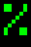 |  |  |  |  
042+ |  |  |  |  |  |  |  |  | 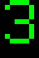 |  
052+ |  |  |  |  |  | 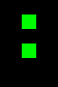 |  |  |  |  
062+ |  |  |  |  |  |  |  |  |  |  
072+ |  |  |  |  | 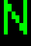 |  |  |  |  |  
082+ |  |  |  | 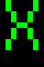 |  |  |  |  |  |  
092+ |  |  |  |  |  |  |  |  |  |  
102+ |  | 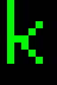 |  |  | 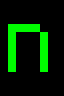 |  |  |  | 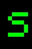 |  
112+ |  |  | 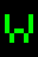 | 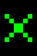 |  | 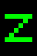 | 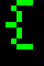 |  |  |  
122+ |  |  |  |  |  |  |  |  |  |  
132+ |  |  |  |  |  |  |  |  |  |  
142+ |  |  |  |  |  |  |  |  |  |  
152+ |  |  |  |  | 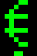 |  |  |  |  |  
162+ |  |  |  |  | 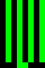 |  |  |  |  |  
172+ |  |  |  |  |  | 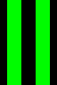 |  |  |  |  
182+ |  |  |  |  |  |  |  |  |  |  
192+ |  |  |  |  |  |  |  |  |  |  
202+ |  |  |  |  |  |  |  |  |  |  
212+ |  | 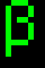 |  |  | 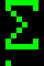 | 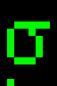 | 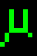 | 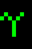 |  |  
222+ | 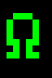 | 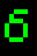 |  |  | 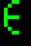 |  |  |  | 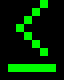 |  
232+ |  |  |  | 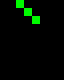 |  |  |  |  | 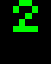 |  
