## Font 5

&nbsp; |  0  |  1  |  2  |  3  |  4  |  5  |  6  |  7  
:-:    | :-: | :-: | :-: | :-: | :-: | :-: | :-: | :-: 
00 | &nbsp; |  |  |  |  |  |  | 
08 |  |  |  |  |  |  |  | 
10 |  |  |  |  |  |  |  | 
18 |  |  |  |  |  |  |  | 
20 |  |  |  |  |  |  |  | 
28 | 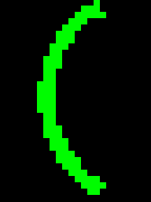 |  |  |  |  |  |  | 
30 |  |  |  |  |  |  | 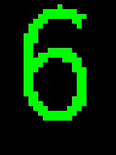 | 
38 |  |  |  |  |  | 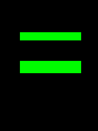 | 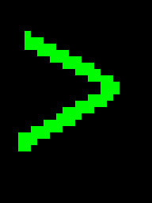 | 
40 | 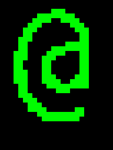 |  |  | 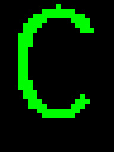 |  |  |  | 
48 |  |  |  |  |  |  |  | 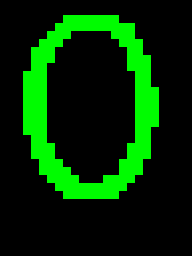
50 |  |  |  |  |  | 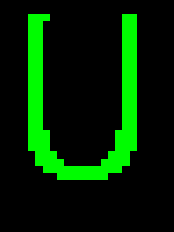 |  | 
58 |  |  |  |  |  | ![\]](font5/5D.png) |  | 
60 | 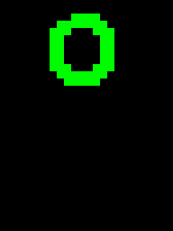 |  |  |  |  |  |  | 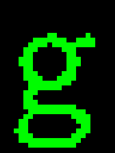
68 |  |  |  | 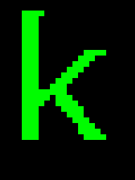 |  |  |  | 
70 |  | 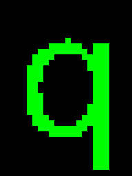 |  |  |  |  |  | 
78 |  |  |  | 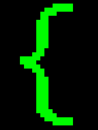 |  |  | 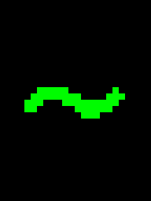 | 
80 |  |  |  |  |  |  |  | 
88 |  |  |  |  |  |  |  | 
90 |  |  |  |  |  |  |  | 
98 |  |  |  |  |  |  |  | 
A0 |  |  |  |  |  |  |  | 
A8 |  |  |  |  |  |  |  | 
B0 |  |  |  |  |  |  |  | 
B8 |  |  |  |  |  |  |  | 
C0 |  |  |  |  |  |  |  | 
C8 |  |  |  |  |  |  |  | 
D0 |  |  |  |  |  |  |  | 
D8 |  |  |  |  |  |  |  | 
E0 |  |  |  |  |  |  |  | 
E8 |  |  |  |  |  |  |  | 
F0 |  |  |  |  |  |  |  | 
F8 |  |  |  |  |  |  |  | 