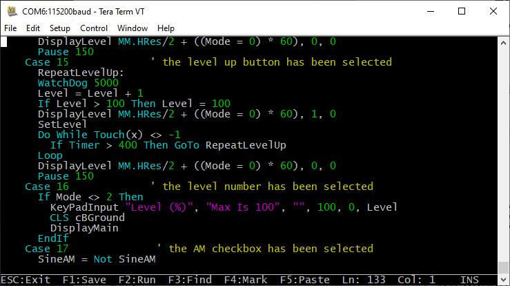

# Full Screen Editor

  

An important productivity feature is the built-in full screen editor. When running it looks like this:

The editor operates with:

- The serial console using a VT100 supported terminal emulator (such as Tera Term) on all versions.
- The VGA or HDMI video output (on versions with this feature).
- An attached LCD panel that has been configured with `OPTION LCDPANEL CONSOLE`.

When the editor starts up the cursor will be automatically positioned at the last place that you were editing or, if your program had just been stopped by an error, the cursor will be positioned at the line that caused the error. At the bottom of the screen the status line lists details such as the current cursor position and the common functions supported by the editor.

If you have previously used an editor like Windows Notepad you will find that the operation of this editor is familiar. The **arrow keys** will move the cursor around in the text, home and end will take you to the beginning or end of the line. **Page up** and **page down** will do what their titles suggest. The **delete** key will delete the character at the cursor and **backspace** will delete the character before the cursor. The **insert** key will toggle between insert and overtype modes. 

About the only unusual key combination is that two **home** key presses will take you to the start of the program and two **end** key presses will take you to the end.

At the bottom of the screen the status line will list the various function keys used by the editor and their action.

In more details these are:

| Key | Name | Description |
| :-: | :-: | :- |
| **ESC** | | This will cause the editor to abandon all changes and return to the command prompt with the program memory unchanged. If you have changed the text you will be asked if you really what want to abandon your changes. |
| **F1** | SAVE | This will save the program to program memory and return to the command prompt. |
| **F2** | RUN | This will save the program to program memory and immediately run it. |
| **F3** | FIND | This will prompt for the text that you want to search for. When you press enter the cursor will be placed at the start of the first entry found. |
| **SHIFT** - **F3** | | Once you have used the search function you can repeat the search by pressing **SHIFT**-**F3**. |
| **F4** | MARK |This is described in detail below. |
| **F5** | PASTE |This will insert (at the current cursor position) the text that had been previously cut or copied (see below). |

If you pressed the mark key (**F4**) the editor will change to the mark mode. In this mode you can use the arrow keys to mark a section of text which will be highlighted in reverse video. You can then delete, cut or copy the marked text. In this mode the status line will change to show the functions of the function keys in the mark mode.

These keys are:

| Key | Name | Description |
| :-: | :-: | :- |
| **ESC** | | Will exit mark mode without changing anything. |
| **F4** | CUT | Will copy the marked text to the clipboard and remove it from the program. |
| **F5** | COPY | Will just copy the marked text to the clipboard. |
| **DELETE**| | Will delete the marked text leaving the clipboard unchanged. |

You can also use control keys instead of the function keys listed above. These control keystrokes are:

| function key | control key | | function key | control key | | function key | control key | | function key | control key |
| :-:          | :-:         |-| :-:          | :-:         |-| :-:          | :-:         |-| :-:          | :-:         |
| **UP** | Ctrl-E | | **DOWN** | Ctrl-X | | **LEFT** | Ctrl-S | | **RIGHT** | Ctrl-D |
| **PageUp** | Ctrl-P | | **PageDn** | Ctrl-L | | **HOME** | Ctrl-U | | **END** | Ctrl-K |
| **F1** | Ctrl-Q | | **F2** | Ctrl-W | | **DEL** | Ctrl-] | | **INSERT** | Ctrl-N |
| **F4** | Ctrl-T | | **F5** | Ctrl-Y | | **F3** | Ctrl-R | | **Shift** - **F3** | Ctrl-G |

The best way to learn how to use the editor is to simply fire it up and experiment. 🔥

The editor is a very productive method of writing a program. With the command `EDIT` you can enter your program then, by pressing the **F2** key, you can save and run the program.

If your program stops with an error pressing the function key **F4** at the command prompt will load the editor and position the cursor at the line that caused the error. This edit/run/edit cycle is very fast.

## Long Lines

Long lines will only display the first part of the line up to the display’s right hand margin. The rest of the line beyond the right hand margin is still there but it is not displayed and cannot be edited.

If you want to edit a very long line you can position the cursor near the right hand margin and press **Enter**. This will split the long
line into two and both parts can be separately edited. To rejoin the line use the Delete or Backspace key to remove the line break that you previously entered.

Alternatively, you can enable continuation lines (`OPTION CONTINUATION LINES ON`) before entering the editor. The allows you to use a space followed by and underscore character at the end of a line to indicate that the next line is a continuation and should be concatenated in order for the program to run. 

The concatenation occurs when the file is saved and when re-edited long lines are automatically split up as the file is read into the editor. The line breaks may not be in the same place but the editor attempts to place them in sensible positions (at the end of words etc.). 

There are no limits on where continuation characters are placed. For example, they can be in the middle of a quoted string. The limit of a maximum of 255 characters in a concatenated line still applies and the editor will not allow you to exit if a line is too long.

## Using a Mouse

Versions of the PicoMite firmware that support VGA/HDMI (in both the RP2040 and RP2350 versions) also
supports the use of a PS2 or USB mouse in the editor. For the details of connecting a mouse see the heading
Keyboard/Mouse/Gamepad later in this manual.

If you start the editor with a mouse plugged in and are in video `MODE 1` with colour coding enabled you will
see a character highlighted with red on a white background. This highlight can be moved using the mouse. 

Left clicking on the mouse will move the edit cursor to that position (ie, the same as using the cursor keys). 

Right clicking the mouse is the same as pressing **F4** on the keyboard and clicking the scroll wheel is the same as **F5**.

This means that in the editor’s normal mode you can position the mouse cursor and by right clicking the editor
will enter mark mode (cut-and-copy) with the cursor starting where the mouse cursor was. Then moving the
mouse and then left clicking will highlight the characters from the mark position to the new mouse position.

Right clicking (same as **F4**) will cut the highlighted region to the clipboard while clicking the scroll wheel (same as **F5**) will copy the highlighted text to the clipboard without deleting it from the text. Both will return the editor to normal mode.

In normal mode the contents of the clipboard can be inserted into the text by moving the mouse to the new
position and clicking the scroll wheel (same as **F5**).

## Colour Coded Editor Display

The editor can colour code the edited program with keywords, numbers and comments displayed in different colours. This feature can be turned on or off with the command:

`OPTION COLOURCODE ON` or `OPTION COLOURCODE OFF`

This option is saved in non-volatile memory and automatically applied on start-up.