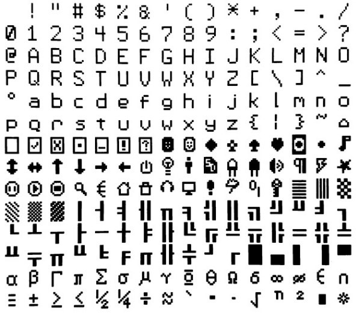
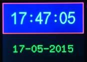

# Graphics Functions

These commands and functions operate on attached LCD panels and VGA/HDMI video outputs. A tutorial on using these facilities is included in the firmware distribution file.

See the file: Graphics in the PicoMite.pdf


## Colours

Colour is specified as a true colour 24 bit number where the top eight bits represent the intensity of the red colour, the middle eight bits the green intensity and the bottom eight bits the blue. The easiest way to generate this number is with the RGB() function which has the form:

```basic
RGB(red, green, blue)
```

The RGB() function also supports a shortcut where you can specify common colours by naming them. For example, `RGB(red)` or `RGB(cyan)`. The colours that can be named using the shortcut form are white, black, blue, green, cyan, red, magenta, yellow, brown, white, orange, pink, gold, salmon, beige, lightgrey and grey (or USA spelling gray/lightgray).

MMBasic will automatically translate all colours to the format required by the individual display controller.

For example, in the case of the ILI9341 LCD controller, is 64K colours in the 565 format.

The default for commands that require a colour parameter can be set with the COLOUR command (can also be spelt COLOR). This is handy if your program uses a consistent colour scheme, you can then set the defaults and use the short version of the drawing commands throughout your program.

The COLOUR command takes the format: `COLOUR foreground-colour, background-colour`

## Fonts

also see [the chapter on fonts](./fonts.md) for detailed depictions

### Built-in Fonts

There are eight built in fonts. These are:

Font<br>Number| Size<br>(width x height) | Character <br> Set | Description
:-: | :-: | :-: | :-  
[1](./fonts/font1.md) | 8 x 12 | All 95 ASCII characters<br>plus 7F to FF (hex) | Standard font (default on start-up).
[2](./fonts/font2.md) | 12 x 20 | All 95 ASCII characters | Medium sized font.
[3](./fonts/font3.md) | 16 x 16 | All 95 ASCII characters | A large font for VGA versions
[3](./fonts/font3.md) | 16 x 24 | All 95 ASCII characters | A large font for HDMI versions and LCD panels.
[4](./fonts/font4.md) | 10x16 | All 95 ASCII characters <br> plus 7F to FF (hex) | A font with extended graphic characters. <br>Suitable for high resolution displays.
[5](./fonts/font5.md) | 24 x 32 | All 95 ASCII characters | Extra large font, very clear.
[6](./fonts/font6.md) | 32 x 50 | 0 to 9 <br>+ some symbols | Numbers plus decimal point, positive,<br> negative, equals, degree and colon symbols. <br> Very clear.
[7](./fonts/font7.md) | 6x8 | All 95 ASCII characters | A small font useful when low resolutions are used.
[8](./fonts/font8.md) | 4x6 | All 95 ASCII characters | An even smaller font.

<div style="float: right; margin-left: 20px;">
  
</div>

Note that font 3 has a 16 x 16 pixel size when used with VGA video output but a 16 x 24 size for HDMI and LCD panels.

In all fonts (including font #6) the back quote character `` ` `` (60 hex or 96 decimal) has been replaced with the degree symbol `º`.

Font #1 (the default font) and font #4 have an extended character set covering all characters from `CHR$(32)` to `CHR$(255)` or 20 to FF (hex) as illustrated on the right.

<br style="clear:both" />

### Embedded Fonts

If required, additional fonts can be embedded in a BASIC program. These fonts work exactly same as the built in font (i.e. selected using the FONT command or specified in the TEXT command).

The format of an embedded font is:

```basic
DefineFont #Nbr
  hex [[ hex[…]
  hex [[ hex[…]
END DefineFont
```

It must start with the keyword "DefineFont" followed by the font number (which may be preceded by an optional `#` character). Any font number in the range of `2` to `5` and `8` to `16` can be specified and if it is the same as a built in font it will replace that font.

The body of the font is a sequence of 8-digit hex words with each word separated by one or more spaces or a new line. The font definition is terminated by an `End DefineFont ` keyword. These can be placed anywhere in a program and MMBasic will skip over it. This format is the same as that used by the Micromite.

Additional fonts and information can be found in the Embedded Fonts folder in the PicoMite firmware download. These fonts cover a wide range of character sets including a symbol font (Dingbats) which is handy for creating on screen icons, etc.


## Screen Coordinates

All coordinates and measurements on the screen are done in terms of pixels with the X coordinate being the horizontal position and Y the vertical position. The top left corner of the screen has the coordinates X = 0 and Y = 0 and the values increase as you move down and to the right of the screen.

There are four read only variables which provide useful information about the display currently connected:

* `MM.HRES` : Returns the width of the display (the X axis) in pixels.
* `MM.VRES` : Returns the height of the display (the Y axis) in pixels.
* `MM.INFO(FONTHEIGHT)` : Returns the height of the current default font (in pixels). All characters in a font have the same height.
* `MM.INFO(FONTWIDTH)` : Returns the width of a character in the current font (in pixels). All characters have the same width.


## Drawing Commands

There are ten basic drawing commands that you can use within MMBasic programs to draw graphics. Most of
these have optional parameters. You can completely leave these off the end of a command or you can use two commas in sequence to indicate a missing parameter. For example, the fifth parameter of the LINE command is optional so you can use this format:

```basic
LINE 0, 0, 100, 100, , rgb(red)
```

Optional parameters are indicated below by italics, for example: *font*

In the following commands `C` is the drawing colour and defaults to the current foreground colour. `FILL` is the fill colour which defaults to `-1` which indicates that no fill is to be used.

The basic drawing commands are:

* `CLS C`

  Clears the screen to the colour C.
  
  If C is not specified the current default background colour will be used.
  
* `PIXEL X, Y, C`
  Illuminates a pixel.
  
  If C is not specified the current default foreground colour will be used.
  
* `LINE X1, Y1, X2, Y2, LW, C`

  Draws a line starting at X1 and Y1 and ending at X2 and Y2.
  
  LW is the line’s width and is only valid for horizontal or vertical lines. It defaults to 1 if not specified or if the line is a diagonal.
  
  There is an extended version for diagonal lines (see LINE AAA).

* `BOX X, Y, W, H, LW, C, FILL`

  Draws a box starting at X and Y which is W pixels wide and H pixels high.
  
  LW is the width of the sides of the box and can be zero. It defaults to 1.
  
* `RBOX X, Y, W, H, R, C, FILL`

  Draws a box with rounded corners starting at X and Y which is W pixels wide and H pixels high.
  
  R is the radius of the corners of the box. It defaults to 10.
  
* `CIRCLE X, Y, R, LW, A, C, FILL`

  Draws a circle with X and Y as the centre and a radius R.
  
  `LW` is the width of the line used for the circumference and can be zero (defaults to 1).
  
  A is the aspect ratio which is a floating point number and defaults to 1.
  
  For example, an aspect of 0.5 will draw an oval where the width is half the height.
  
* `TEXT X, Y, STRING, ALIGNMENT, FONT, SCALE, C, BC`

  Displays a string starting at X and Y.
  
  `ALIGNMENT` is 0, 1 or 2 characters (a string expression or variable is also allowed) where the first letter is the horizontal alignment around X and can be L, C or R for `LEFT`, `CENTER` or `RIGHT` aligned text and the second letter is the vertical alignment around Y and can be T, M or B for `TOP`, `MIDDLE` or `BOTTOM` aligned text. The default alignment is left/top.
  
  An additional code letter can be used to rotate the text (see below for the details).
  
  `FONT` and `SCALE` are optional and default to that set by the `FONT` command.
  
  C is the drawing colour and `BC` is the background colour. They are optional and default to that set by the `COLOUR` command.
  
* `GUI BITMAP X, Y, BITS, WIDTH, HEIGHT, SCALE, C, BC`

  Displays the bits in a bitmap starting at X and Y. `HEIGHT` and `WIDTH` are the dimensions of the bitmap as displayed on the LCD panel and default to 8x8.
  
  `SCALE`, C and `BC` are the same as for the `TEXT` command.
  
  The bitmap can be an integer or a string variable or constant and is drawn using the first byte as the first bits of the top line (bit 7 first, then bit 6, etc) followed by the next byte, etc.
  
  When the top line has been filled the next line of the displayed bitmap will start with the next bit in the integer or string.
  
* `POLYGON n, xarray%(), yarray%() [, bordercolour] [, fillcolour]`

  Draws a filled or outline polygon with n xy-coordinate pairs in `xarray%()` and `yarray%()`.
  
  If `fillcolour` is omitted then just the polygon outline is drawn.
  
  If `bordercolour` is omitted then it will default to the current default foreground colour.
  
* `ARC x, y, r1, [r2], a1, a2 [, c]`

  Draws an arc of a circle with a given colour and width between two radials (defined in degrees).
  
  Parameters for the `ARC` command are the x and y coordinates of the centre of the arc, the inner and outer radii, the start and end angles of the arc and the colour of the arc. The zero degrees reference is at the 12 o’clock position


### Rotated Text

As described above the alignment of the text in the `TEXT` command can be specified by using one or two characters in a string expression for the third parameter of the command. In this string you can also specify a 3ʳᵈ character to indicate the rotation of the text.

3ʳᵈ char | Meaning | Description
:-: | :-: | :-
`N` | normal |  normal orientation (*default*)
`V` | vertical | for vertical text with each character under the previous running from top to bottom.
`I` | inverted | the text will be inverted (i.e. upside down)
`U` | up | the text will be rotated counter clockwise by 90º
`D` | down | the text will be rotated clockwise by 90º

As an example, the following will display the text "LCD Display" vertically down the left hand margin of the display panel and centred vertically:

```basic
TEXT 0, 250, "LCD Display", "LMV", 5
```

Positioning is relative to the top left corner of the character when viewed normally so inverted `100,100` will have the top left pixel of the first character at `100,100` and the text will then be above y=101 and to the left of x=101. Similarly, `R` in the alignment string is viewed from the perspective of the character in whatever orientation it is in (not the screen).


### Transparent Text

The VGA or HDMI video output or LCD displays using the SSD1963, ST7796S, ILI9341, ST7789_320, or
ILI9488 with MISO connected are capable of transparent text.

In this case the TEXT command will allow the use of `-1` for the background colour. This means that the text is drawn over the background with the background image showing through the gaps in the letters.


## Framebuffers and Layers

All variants of the firmware can create one or two in memory framebuffers and one or two layer buffers (this is memory dependent). These are areas of memory with the same width and height as the main display. In the case of HDMI and VGA displays they will have the same colour depth as the current mode. In the case of LCD displays, they will have 4-bits per pixel (16 colours).

Depending on the version of the firmware and current display mode, creation of framebuffers or layer buffers will either use pre-allocated memory or allocate memory from user memory.

Framebuffers can be used to construct image data that can be copied to the physical display. Layer buffers are typically used to create partial images that can sit on top of a background display image and provide an efficient method of moving display elements over a static background.

All standard graphics drawing commands can be used on a framebuffer or layer buffer in the same way as if
writing to the physical display. The `FRAMEBUFFER WRITE` command is used to direct the destination of the
graphic output using a code.
The code is a single character which can be:

- `N` The physical output device.
- `F` The framebuffer.
- `2` A second framebuffer (RP2350 only)
- `L` The layerbuffer
- `T` A second layerbuffer (RP2350 only)

The basic framebuffer commands are:

```basic
FRAMEBUFFER CREATE  ‘ code F
FRAMEBUFFER LAYER   ‘ code L
FRAMEBUFFER CLOSE
FRAMEBUFFER WRITE code
FRAMEBUFFER COPY code1, code2 [,B]
```

See the detail command descriptions for addition framebuffer commands.

In the case of VGA and HDMI versions of the firmware, depending on the display mode and CPU speed (>=252MHz), layers are automatically applied on top of the main display image as it is output to the screen. In the case of LCD displays the FRAMEBUFFER MERGE command is used to create the final image from a framebuffer and a layer buffer. The game [PETSCII robots](https://github.com/thwill1000/mmbasic-robots) shows how this technique can be used to great effect.

The automatic application of a layer buffer is implemented in VGA versions mode 2 and mode 3 (RP2350 only) as well as HDMI modes 2, 3, 4, and 5. Two layers buffers are only available on the RP2350 and in the following modes: VGA mode 2, HDMI modes 2 and 5.

## BLIT and Sprite Commands
In previous versions of the firmware the blit and sprite commands were synonyms for the same functionality. In release 6.00.00 onwards they are separate commands. The distinction is that BLIT is a simple memory operation copying to and from a display or memory to a display or memory. Sprites are more complex and allow the programmer to display elements over a background and then move them over the background without corrupting the background image. In addition, the programmer can use the sprite functionality to detect collisions between sprites and between a sprite and the edges of the display.

Sprites cannot be used unless the display supports reading from its framebuffer and blit functionality is also limited unless this is the case. Sprites are enabled for all versions of the firmware when used on a an in-memory framebuffer and VGA and HDMI versions of the firmware directly with the screen.

Sprites are always stored as RGB121 nibbles with 2 pixels to a byte. In contrast BLIT buffers are stored as RGB888 values and so can be used with full colour LCD displays. Of course this comes at the expense of
significantly greater memory usage.

See the [SPRITE command](command/sprite.md) and function together with Appendix G for more information on using sprites.

If the display is capable of transparent text the BLIT command allows a portion of the image currently showing on the display to be copied to a memory buffer and later copied back to the display. This is useful when something needs to be drawn over the background and later removed without damaging the image in the background. Examples include a game where a character is moving about in front of a landscape or the moving needle of a photorealistic gauge.

The available standard blit commands are:

```basic
BLIT READ #b, x, y, w, h
BLIT WRITE #b, x, y [,mode]
BLIT LOAD #b, f$, x, y, w, h
BLIT CLOSE #b
```

#b is the buffer number in the range of 1 to 64. 

x and y are the coordinates of the top left corner and w and h are the width and height of the image.

`READ` will copy the display image to the buffer, 

`WRITE` will copy the buffer to the display and `CLOSE` will free up the buffer and reclaim the memory used. `LOAD` will load an image file into the buffer.

`BLIT LOAD` and `BLIT WRITE` will work on any display while `BLIT` and `BLIT READ` will only work on displays capable of transparent text (i.e. using the SSD1963, ILI9341, ST7789_320, or ILI9488 with MISO connected) as well as VGA and HDMI displays and any in-memory framebuffers

These commands can be used to copy a portion of the display to another location (by copying to a buffer then writing somewhere else) but a simpler method is to use an alternative version of the `BLIT` command as follows:

```basic
BLIT x1, y1, x2, y2, w, h
```

This will copy a portion of the image at x1/y1 to the location x2/y2. w and h specify the width and height of the image to be copied. The source and destination areas can overlap and the `BLIT` command will perform the copy correctly.

This form of the `BLIT` command is particularly useful for creating graphs that can scroll horizontally or vertically as new data is added.

In addition, the firmware provides `BLIT MEMORY`, `BLIT COMPRESSED`, `BLIT FRAMEBUFFER`, and `BLIT MERGE` commands.

These advanced commands can be used to help code games with hundreds of display elements such as the port to MMBasic of PETSCII robots.


## Load Image

The `LOAD IMAGE` and `LOAD JPG` commands can be used to load an image from the Flash Filesystem or SD
Card and display it on the LCD display. This can be used to draw a logo or add an ornate background to the
graphics drawn on the display.

## Advanced Graphics
*NOT AVAILABLE IN VGA/HDMI AND WEBMITE RP2040 VERSIONS*

The PicoMite firmware includes a suite of advanced graphics functions to make it easy for a programmer to create touch sensitive control elements on an LCD panel as illustrated. These include on screen switches, buttons, indicator lights, keyboard, etc.

MMBasic will draw the control and animate it (ie, a switch will appear to depress when touched). All that the BASIC programmer needs to do is invoke a single command to specify the basic details of the control.

These functions make it easy to create a control panel to manage any control functions like a lathe, motor controller, heating system, small industrial process and so on.

The Advanced Graphics functions are described in detail in the document Advanced Graphics Functions.pdf
which is included in the firmware download file.

## 3D Engine

*NOT AVAILABLE IN WEBMITE VERSIONS*

The 3D Engine includes ten commands for manipulating 3D images including setting the camera, creating, hiding, rotating, etc. See the document [Appendix J - The CMM2 3D engine](J_CMM2_3D_engine.md) for a full description of these commands and how to use them.

## LCD Graphics Example
As an example of using the simple graphics commands the following program will draw a simple digital clock on an ILI9341 based LCD display. The program will terminate and return to the command prompt if the
display screen is touched.

First the display and touch options must be configured by entering the commands listed at the beginning of this chapter. The exact format of these will depend on how you have connected the display panel.

Then enter and run the program:

```basic
CONST DBlue = RGB(0, 0, 128)         ' A dark blue colour
COLOUR RGB(GREEN), RGB(BLACK)        ' Set the default colours
FONT 1, 3                            ' Set the default font
BOX 0, 0, MM.HRes-1, MM.VRes/2, 3, RGB(RED), DBlue
DO
TEXT MM.HRes/2, MM.VRes/4, TIME$, "CM", 1, 4, RGB(CYAN), DBlue
TEXT MM.HRes/2, MM.VRes*3/4, DATE$, "CM"
IF TOUCH(X) <> -1 THEN END
LOOP
```

This program starts by defining a constant with a value corresponding to a dark blue colour and then sets the defaults for the colours and the font. It then draws a box with red walls and a dark blue interior.

Following this the program enters a continuous loop where it performs three functions:

1. Displays the current time inside the previously drawn box. The string is drawn centred both horizontally and vertically in the middle of the box. Note that the `TEXT` command overrides both the default font and
colours to set its own parameters.
2. Draws the date centred in the lower half of the screen. In this case the `TEXT` command uses the default
font and colours previously set.
3. Checks for a touch on the screen. This is indicated when the `TOUCH(X)` function returns something
other than `-1`. In that case the program will terminate.

The screen display should look like this (the font used in this illustration is different):

<div style="margin: .5em 5em;">
  
</div>


## Supported Hardware


### LCD Panels

The resolution and number of colours supported by an LCD panel is determined by the panel itself and the
driver – see the chapter [Display Panels](./display_panels.md) for the details.


### VGA Video

There are a number of modes which can be selected using the MODE command:


#### OPTION RESOLUTION 640x480

MODE | RESOLUTION | COLOUR | BUFFER
:-: | :-: | :-: | :- 
MODE 1 | 640x480 | monochrome<br>with RGB121 tiles | optional layer buffer
MODE 2 | 320x240 | 4-bit colour | optional layer buffer (RP2350 only) <br>2<sup>nd</sup> optional layer buffer
MODE 3 | 640x480 | 4-bit colour | optional layer buffer (RP2350 only)


#### OPTION RESOLUTION 720x400

MODE | RESOLUTION | COLOUR | BUFFER
:-: | :-: | :-: | :- 
MODE 1 | 720x400 | monochrome <br>with RGB121 tiles | optional layer buffer
MODE 2 | 360x200 | 4-bit colour |  | optional layer buffer (RP2350 only) <br>2<sup>nd</sup> optional layer buffer
MODE 3 | 720x400 | 4-bit colour |  | optional layer buffer (RP2350 only)


#### OPTION RESOLUTION 800x600 (RP2350 only)

MODE | RESOLUTION | COLOUR | BUFFER
:-: | :-: | :-: | :- 
MODE 1 | 800x600 | monochrome <br>with RGB121 tiles | optional layer buffer
MODE 2 | 400x300  | 4-bit colour | two optional layers
MODE 3 | 800x600  | 4-bit colour | optional layer buffer


#### OPTION RESOLUTION 848x480 (RP2350 only)

MODE | RESOLUTION | COLOUR  | BUFFER
:-: | :-: | :-: | :- 
MODE 1 | 848x480 | monochrome <br>with RGB121 tiles | optional layer buffer
MODE 2 | 424x240  | 4-bit colour |  two optional layers
MODE 3 | 848x480 | 4-bit colour | optional layer buffer


### HDMI Video (RP2350 only)

Each HDMI resolution can operate in a number of modes which are set using the `MODE` command:

#### OPTION RESOLUTION 640x480

MODE | RESOLUTION-COLOUR  | BUFFER
:-: | :- | :- 
MODE 1 | 640x480x2-colours with RGB555 | optional layer buffer
MODE 2 | 320x240x16colours <br>and colour mapping to RGB555 palette | two optional layers
MODE 3 | 640x480x16 colours <br> and colour mapping to RGB555 palette | optional layer buffer
MODE 4 | 320x240x32768 colours | optional layer buffer
MODE 5 | 320x240x256 colours <br> and colour mapping to RGB555 palette | optional layer buffer

#### OPTION RESOLUTION 720x400

MODE | RESOLUTION-COLOUR  | BUFFER
:-: | :- | :- 
MODE 1 | 720x400 monochrome <br>with RGB555 tiles| optional layer buffer
MODE 2 | 360x200 4-bit colour and colour mapping to RGB555 palette| two optional layers
MODE 3 | 720x400 4-bit colour and colour mapping to RGB555 palette| optional layer buffer
MODE 4 | 360x200x32768 colours| optional layer buffer
MODE 5 | 360x200x256 colours and colour mapping to RGB555 palette| optional layer buffer


#### OPTION RESOLUTION 800x600 (RP2350 only)

MODE 1 | 800x600 monochrome with RGB332 tiles| optional layer buffer
MODE 2 | 400x300 4-bit colour and colour mapping to RGB332 palette| optional layer buffer
MODE 3 | 800x600 4-bit colour and colour mapping to RGB332 palette| optional layer buffer
MODE 5 | 400x300x256 colours| optional layer buffer


#### OPTION RESOLUTION 848x480 (RP2350 only)

MODE 1 | 848x480 monochrome with RGB332 tiles| optional layer buffer
MODE 2 | 424x240 4-bit colour and colour mapping to RGB332 palette| optional layer buffer
MODE 3 | 848x480 4-bit colour and colour mapping to RGB332 palette| optional layer buffer
MODE 5 | 424x240x256 colours| optional layer buffer

#### OPTION RESOLUTION 1280x720

MODE 1 | 1280x720x2-colours with RGB332| optional layer buffer
MODE 2 | 320x180x16colours and colour mapping to RGB332 palette| optional layer buffer
MODE 3 | 640x360x16 colours and colour mapping to RGB332 palette| optional layer buffer
MODE 5 | 320x180x256 colours| optional layer buffer


#### OPTION RESOLUTION 1024x768

MODE 1 | 1024x768x2-colours with RGB332tiles| optional layer buffer
MODE 2 | 256x192x16colours and colour mapping to RGB332 palette| optional layer buffer
MODE 3 | 512x384x16 colours and colour mapping to RGB332 palette| optional layer buffer
MODE 5 | 256x192x256 colours| optional layer buffer