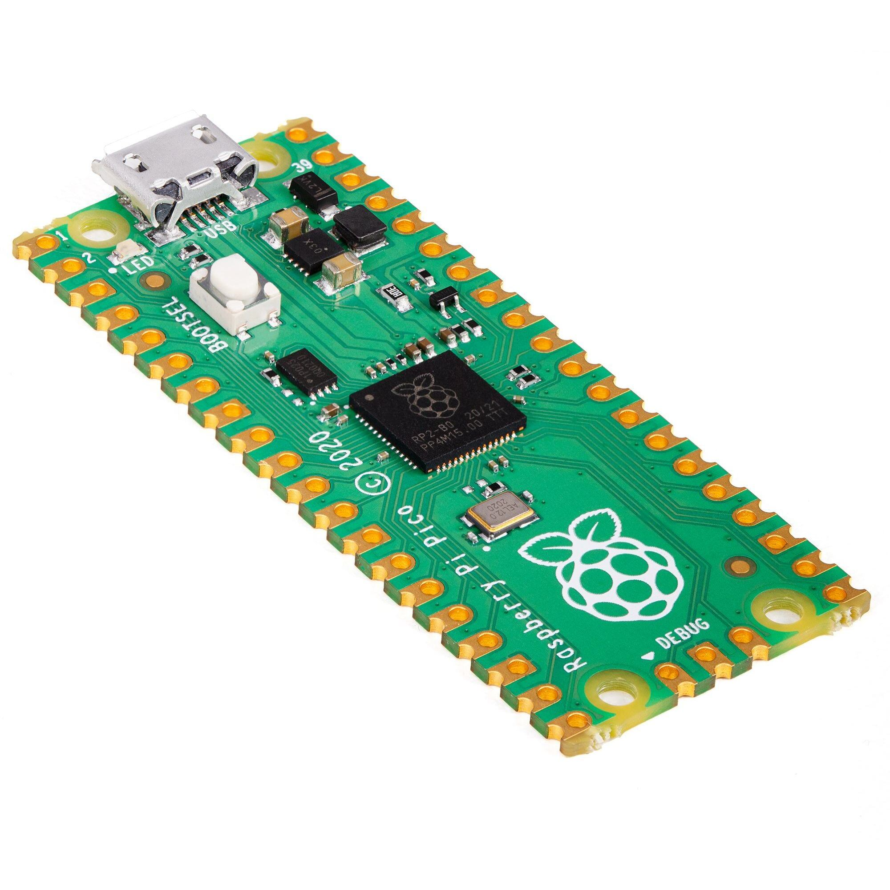

# Introduction

  

The PicoMite is an operating firmware for all versions of the Raspberry Pi Pico including the Pico, Pico 2, Pico W and Pico 2 W.

It includes a BASIC interpreter (MMBasic) which is a Microsoft BASIC compatible implementation of the BASIC language with floating point, integer and string variables, arrays, long variable names, a built in program editor and many other features.

The PicoMite firmware also supports third party boards based on the RP2040 and RP2350 and processors from companies such as Pimoroni, Adafruit and Waveshare.

There are versions of the PicoMite firmware suited for embedded controller applications (such as a heating
controller, burglar alarm, etc) as well as versions with VGA/HDMI video suited to building a self contained
computer with a keyboard.

 

Using MMBasic you can control the I/O pins and use communications protocols such as I²C or SPI to get data
from a variety of sensors. You can display data on low-cost colour LCD displays, measure voltages, detect
digital inputs and drive output pins to turn on lights, relays, etc. And with the Raspberry Pi Pico W you can
access the internet and build a WEB server on this low cost module.

The PicoMite firmware is totally free to download and use.

In summary the features of the PicoMite firmware are:

- **The BASIC interpreter is full featured** with double precision floating point, 64-bit integers and string
variables, long variable names, arrays of floats, integers or strings with multiple dimensions, extensive
string handling and user defined subroutines and functions. In addition, MMBasic allows the embedding
of compiled C programs for high performance functions. The emphasis is on ease of use and
development.

- **Support for all Raspberry Pi Pico input/output pins.** These can be independently configured as
digital input or output, analog input, frequency or period measurement and counting. Interrupts can be
used to notify when an input pin has changed state. PWM outputs can be used to create various sounds,
control servos or generate computer-controlled voltages.

- **Support for TFT LCD display panels** using parallel, SPI and I²C interfaces allowing the BASIC
program to display text and draw lines, circles, boxes, etc in up to 16 million colours. Resistive touch
controllers on these panels are also supported allowing them to be used as sophisticated input devices.

- **Support for Internet and WEB protocols using the Raspberry Pi Pico W and Pico 2 W.** This
includes a WEB server using TCP and HTML, accessing other resources using TCP and HTTP. MQTT
protocol for connecting via a message broker. NTP protocol for getting the date/time from a time server.
Telnet for remote console access and TFTP for fast file transfer.

- **Support for a PS2 or USB keyboard and HDMI or VGA video output.** This includes full support for
graphics, audio (sound effects and music), internal program storage, game controllers and more. This
converts the Raspberry Pi Pico or into a self-contained computer like the Apple II or Tandy TRS-80 of
yesterday. Great for writing games, learning BASIC or just balancing your chequebook

- **Flexible program and data storage.** Programs and data can be read/written from an internal file system
created from the Pico’s flash memory or to an externally connected SD Card up to 32GB formatted as
FAT16 or FAT32. This includes opening files for reading, writing or random access and loading and
saving programs.

- **A full screen editor** is built into the firmware and can edit the whole program in one session. It includes
advanced features such as colour coded syntax, search and copy, cut and paste to and from a clipboard.

- **Programs can be easily transferred** from a desktop or laptop computer (Windows, Mac or Linux) via
the serial console or via an SD card.

- **A comprehensive range of communications protocols** are implemented including I²C, asynchronous
serial, RS232, SPI and 1-Wire. These can be used to communicate with many sensors (temperature,
humidity, acceleration, etc) as well as for sending data to test equipment.

- **Built in commands** to directly interface with infrared remote controls, the DS18B20 temperature sensor,
LCD display modules, battery backed clock, numeric keypads and more.