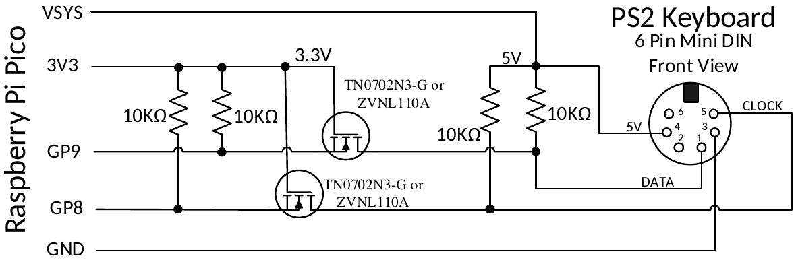
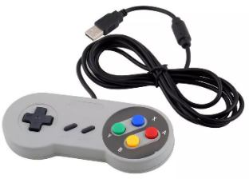

# Keyboard/Mouse/Gamepad

The PicoMite firmware can accommodate a keyboard and mouse using either the PS2 or USB interfaces. The
choice between PS2 and USB is determined by the version of the firmware loaded. See the chapter Firmware
Versions and Files at the start of this manual.

USB versions of the firmware will also support a PS3 or PS4 gamepad with a USB interface. For versions
without USB support the WII (CLASSIC) and WII NUNCHUCK commands can be used to specify a gamepad
connected using I²C.

A keyboard can be used to input data to the BASIC program or, with a VGA/HDMI video output, be used to
create a self contained computer with keyboard and display. Instead of using a video output you can also
connected an LCD panel on versions supporting this and display the MMBasic console output on the LCD
panel, creating a more compact version of a self contained computer. See the section LCD Display as the
Console Output for details on how to do this.


## PS2 Keyboard on the Raspberry Pi Pico (RP2040)

The PS2 keyboard clock and data signals operate at 5V but the I/O pins on the RP2040 processors must not be
subjected to more than 3.6V. For this reason a level shifter should be employed so that the Raspberry Pi Pico
sees signal voltages in the range 0 to 3.3V while the keyboard sees voltages 0 to 5V.

There are many ways that this can be accomplished but the following circuit is a simple and low cost solution:

<div style="clear: both; margin: .5em 2em;">
  
</div>

The recommended MOSFET is a TN0702N3-G or ZVNL110A however the commonly available 2N7000 has
been tested and works well.

After it is connected the keyboard must be enabled with the OPTION KEYBOARD command.

## PS2 Keyboard on the Raspberry Pi Pico 2 (RP2350)

<div style="clear: both; margin: .5em 2em;">
  
</div>


The I/O pins on the RP2350 series of microcontrollers can withstand 5V (while powered up) so the keyboard
can be directly connected as illustrated with the 5V supplied by the VSYS pin on the Raspberry Pi Pico 2.
The keyboard is enabled with the `OPTION KEYBOARD` command.


## PS2 Mouse

The I/O pins used for a PS2 mouse must be configured using the commands OPTION MOUSE (at the
command prompt) or `MOUSE OPEN` (within a program).

A PS2 mouse is powered via 5V so on a Raspberry Pi Pico (RP2040) a level shifter will be required for the
mouse clock and data pins - this can be the same as the above circuit for a PS2 keyboard. On a Raspberry Pi
Pico 2 (RP2350) a level shifter is not required so the mouse can be directly connected.


## USB Interface

Versions of the firmware (both RP2040 or RP2350) with USB support will allow the connection of a keyboard,
mouse and/or gamepad, all via the USB interface. To accomplish this the Raspberry Pi Pico’s USB port is
converted to a USB host (as against its normal mode of USB client). This is possible because the Pico’s
connector and electronics are USB OTG (On The Go) compliant similar to the connector on many mobile
phones.

Because the USB connector is used for other duties the Pico must be powered via 5V applied to the VSYS pin
or the VbUS pin if you desire to power an external hub/keyboard from the pico.

To connect a USB device you need a converter cable which has a Micro Male USB plug on one end (for the
Pico) and a Type A USB socket at the other end (for the device). A typical example is the Jaycar Cat Nbr
WC7725.

Because the USB interface on the Pico has been converted to a USB host you will not have access to the
MMBasic serial console. The firmware accommodates this by automatically using pin 11 (GP8) for the serial
console Tx and pin 12 (GP9) for Rx and setting the baudrate to 115200 baud. To access this console you will
need a USB to serial bridge which provides a TTL serial interface on one side and a USB interface on the other
(search for modules using the CP2102 or CH340 chip). If needed OPTION SERIAL CONSOLE can be used to
change the pins used for the console.


## USB Hub

The firmware will also support a USB hub via this interface so it is possible to have multiple keyboards or a
keyboard plus a mouse plus a gamepad, etc. A maximum of 4 devices may be connected via a hub. These are
reference by a channel index number (1 to 4). Use `MM.INFO(USB n)` to return the device code for any device
connected to channel n. By default a keyboard will be allocated to channel 1. A mouse will be allocated to
channel 2. The first gamepad will be allocated to channel 3 and a second gamepad to channel 4.

If you use a USB hub it is better to use an unpowered hub (ie, one that is powered by the Raspberry Pi Pico).
This is because the USB protocol stack cannot reset the hub and it may be confused if the power on the Pico is
cycled without doing the same for the hub. The hub can also be confused if devices are swapped while the hub
is powered. If this happens you should cycle the power on the Pico followed by the hub then add the USB
devices one by one.

Note that a hub is not required. If you only want to connect one device (for example a keyboard) you can just
plug the device (using an adapter cable) directly into the Pico’s USB connector.


## USB Keyboard

When a USB keyboard is connected it will be immediately recognised (no configuration required) and
MMBasic will allocate it to channel 1 by default– there is nothing extra required.


## USB Mouse

When a USB mouse is connected it will be immediately recognised (no configuration required) and MMBasic
will allocate it to channel 2 by default– there is nothing extra required.


## USB Gamepad
<div style="float: right; margin-left: 20px;">
  
</div>

One or more PS3 or PS4 controllers or gamepad such as a Super Nintendo
SNES Controller with a USB interface can be connected via USB (illustrated on
the right).

By default the first gamepad will be allocated to channel 3 and a second
gamepad channel 4. Within a program the data from the gamepad can be read
using the `DEVICE(GAMEPAD)` function.

<br style="clear:both" />


## Configuring the Keyboard

By default the keyboard configuration will be assumed to be the standard US layout. However the OPTION
KEYBOARD command can be used to configure layouts for other countries.

The syntax of the command is:

```basic
OPTION KEYBOARD language
```

Where `language` is a two-character code such as `US` for the standard keyboard used in the USA, Australia and
New Zealand. Other keyboard layouts are United Kingdom (`UK`), French (`FR`), German (`GR`), Belgium (`BE`),
Italian (`IT`) ), Brazilian (`BR`) or Spanish (`ES`).

Note that the non US layouts map some of the special keys present on these keyboards but the corresponding
special character will not display as they are not part the standard PicoMite fonts. Instead a standard ASCII
character will be used.


## Using a Mouse

The mouse is especially useful in the MMBasic program editor where it can replicate much of the functionality
found in GUI editors such as Notepad in Windows (see the heading Full Screen Editor above in this manual).

This includes positioning the insert point and copy and paste using the clipboard.

A mouse can also be used in a program where its position can be queried by using the `DEVICE()` function. As
an example, the following program will report any mouse movement.

Note that the mouse is always allocated to channel 2

```basic
‘ continuous loop to print on the console any movement
Do
    mx=DEVICE(MOUSE 2, x)
    my=DEVICE(MOUSE 2, y)
    If mx <> tx Or my <> ty Then Print mx, my
    tx = mx : ty = my
Loop
```
