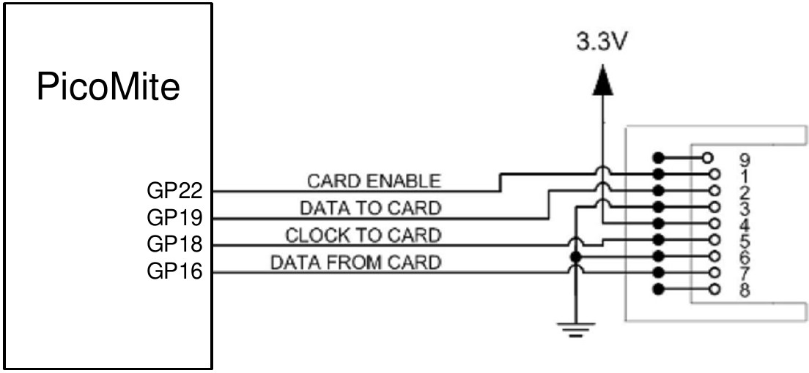
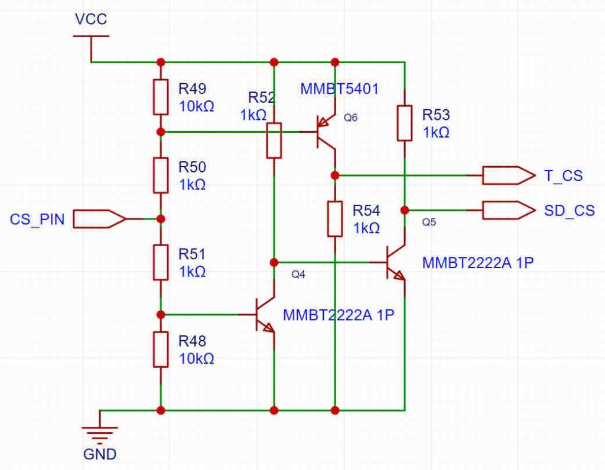

# Program and Data Storage

The BASIC program is held in flash memory and is run from there. When a program is edited via `EDIT` or
loaded via the console it will be saved there. Flash memory is non-volatile so the program will not be lost if the
power is lost or the processors is reset.

In addition to this program memory there are three other locations where programs can be saved. These are
described in detail below and are Flash Slots, the Flash Filesystem and an attached SD Card

Flash Slots
There are three of these which can be used to save completely different programs or previous versions of the
program you are working on (in case you need to revert to an earlier version). In addition, MMBasic will allow
a BASIC program to load and run another program saved to a numbered flash location while retaining all the
variables and settings of the original program – this is called chaining and allows for a much larger program to
be run than the amount of program memory would normally allow.

To manage these numbered locations in flash you can use the following commands (note that in the following n
is a number from 1 to 3):
Command | Description
 :-: | :- 
`FLASH SAVE n` | Save the program in the program memory to the flash location n.
`FLASH LOAD n` | Load a program from flash location n into the program memory.
`FLASH RUN n` | Run a program from flash location n, clears all variables but does not erase or change the program held in the main program memory.
`FLASH LIST` | Display a list of all flash locations including the first line of the program.
`FLASH LIST n [,ALL]` | Lists the program held in location n. Use FLASH LIST n,ALL to list without page breaks
`FLASH ERASE n` | Erase flash location n.
`FLASH ERASE ALL` | Erase all flash locations.
`FLASH CHAIN n` | Run the program in flash location n, leaving all variables intact. This allows for very large programs, that can be split into two or three parts, to be run.<br>It does not erase or change the program held in the main program memory.
`FLASH OVERWRITE n` | Erase flash location n and then save the program in the program memory to that location.
`FLASH DISK LOAD f$ [,O]` | Loads a flash slot with a binary file created using `LIBRARY DISK SAVE`. Overwrites the slot if the optional `O` is specified.

In addition, the command OPTION AUTORUN can be used to specify a flash program location to be set
running when power is applied or the CPU restarted. This option can also be used without specifying a flash
location and in that case MMBasic will automatically run the program in program memory.

Notes:

- It is recommended that you include a comment describing the program as the first line of the program. This
will then be displayed by the `FLASH LIST` command and will help identify the program.
- All BASIC programs saved to flash may be erased if you upgrade (or downgrade) the PicoMite firmware.
So make sure that you backup these first.
- The `LIBRARY` command uses Slot 3 for saving library data therefore only 2 slots will be available if the
library feature is used.


## Flash Filesystem

This is an area of the Raspberry Pi Pico’s flash memory which is automatically created by the firmware and
will look like a normal disk drive to MMBasic. It is called drive A: and data and programs can be read/written
using the normal BASIC file commands (`SAVE`, `RUN`, `OPEN`, etc). In addition, sub directories can be created
and deleted and long filenames used.

For example, to run a program:

```basic
RUN "A:/MyProgram.bas"
```

Open a text file for random access:

```basic
OPEN "A:/data/database.dat" FOR RANDOM as #4
```

This drive is automatically created when the PicoMite firmware is loaded so it will always be available to the
BASIC program. It can be used to store programs, images, music, configuration data, log files and much more.
Its size varies depending on the amount of flash memory – on a Raspberry Pi Pico with 2MB flash it will be
200 to 500KB, on a Raspberry Pi Pico 2 with 4MB flash it will be a little over 2MB and on a module with
16MB the flash filesystem will be up to 14MB in size.

The system will create and maintain the file `BOOTCOUNT` on the Flash Filesystem. This keeps a count of
the number of times the device has been restarted and can be read with the function `MM.INFO(boot count)`.


## SD Cards

An SD card socket can be connected to the Raspberry Pi Pico and accessed as drive B:. Like the Flash
Filesystem the normal BASIC file commands can be used to save/load programs as well as opening data files
for read/write.

Cards up to 32 GB formatted in FAT16 or FAT32 are supported and the files created can also be read/written
on personal computers running Windows, Linux or the Mac operating system. The PicoMite firmware uses the
[SPI protocol](http://en.wikipedia.org/wiki/Serial_Peripheral_Interface_Bus) to talk to the card and this is not influenced by the card type, so all types (Class 4, 10, UHS-1 etc) are supported.

The SPI protocol needs to be specifically configured before it can be used. This can be done in one of two
ways - by using the “system” SPI port or by directly specifying the I/O pins to use:


### System SPI Port

This is a port that will be used for system use (SD card, LCD display and the touch controller on an LCD
panel). There are a number of ports and pins that can be used (see the chapter PicoMite Hardware) but this
example uses SPI on pins GP18, GP19 and GP16 for Clock, MOSI and MISO respectively.

```basic
OPTION SYSTEM SPI GP18, GP19, GP16
```

Then MMBasic must be told that there is an SD card attached and what pin is used for the Chip Select (CS)
signal:

```basic
OPTION SDCARD GP22
```


### Dedicated I/O Pins
Alternatively, where no other devices share the SPI bus with the SD card it can be set up with:

```basic
OPTION SDCARD CS_pin, CLK_pin, MOSI_pin, MISO_pin
```

In this case the pins can be assigned completely flexibly and do not need to be capable of SPI operation but SD
card performance will be better if valid SPI pins are chosen.

These commands must be entered at the command prompt (not in a program) and will cause the PicoMite
firmware to restart. This has the side effect of disconnecting the USB console interface which will need to be
reconnected.

When the Raspberry Pi Pico is restarted MMBasic will automatically initialise the SD Card interface. This SPI
port will then not be available to BASIC programs (ie, it is reserved). To verify the configuration, you can use
the command `OPTION LIST` to list all options that have been set including the configuration of the SD Card.

The basic circuit diagram for connecting the SD Card connector using these pin allocations is illustrated below.

<div style="float: left; margin-right: 20px;">
  
</div>

Raspberry Pi Pico Pins | | SD Card Pins 
:-: | :-: | :-:
&nbsp; | unused | 9
GP22 | card enable | 1
GP19 | data to card | 2
GND | ground | 3
3V3 | 3.3V Power | 4
GP18 | clock to card | 5
GND | ground | 6
GP16 | data from card | 7
&nbsp; | unused | 8

<br style="clear:both" />

Note that you can use many different configurations using various pin allocations – this is just an example based on the configuration commands listed above.

Care must be taken when the SPI port is shared between a number of devices (SD Card, touch, etc). In this case all the Chip Select signals must configured in MMBasic or alternatively disabled by a permanent connection to 3.3V. If this is not done any floating Chip Select signal lines can cause the wrong controller to respond to commands on the SPI bus.


## Combined Chip Select

<div style="clear: both; margin: .5em 2em;">
  
</div>

The chip select pin used for the SD card and the touch controller on an LCD panel can be combined by using the
`OPTION SDCARD COMBINED CS` command. If this is specified the following circuitry is required to
implement the `SD` chip select:

The firmware uses the touch pin as follows:

- TOUCH_CS low: TOUCH_CS low, SD_CS high
- TOUCH CS high: SD_CS low: TOUCH_CS high
- TOUCH CS set as input (high impedance) TOUCH_CS and SD_CS high.

## MMBasic Support for Flash and SD Card Filesystems
The MMBasic support for the Flash Filesystem and SD Cards is almost identical. This allows programs to use
either filesystem with minimal modification. 
- The Flash Filesystem is referred to as drive `A:` 
- while the SD Card (when connected) is drive `B:`. 

The default drive can be set with the `DRIVE` command and then the drive prefix is not needed.

In the following note that:

- Upper/lowercase characters and spaces are allowed. The file system on the SD Card is **NOT** case
sensitive however the Flash Filesystem **IS** case sensitive (this is the only difference between the two).
- Long file/directory names are supported in addition to the old 8.3 format.
- The maximum file/path length is 63 characters.
- Any file path that uses the drive letter must be a full path from the root 
  - For example: `"A:/mypath/myfile.txt"`).
- Directory paths are allowed in file/directory strings. 
  - For example: `OPEN "A:\dir1\dir2\file.txt" FOR …`).
- Either forward or back slashes can be used in paths. 
  - For example: `"\dir\file.txt"` is the same as `"/dir/file.txt"`.
- On startup the active drive (ie, the default) is `A:` (the Flash Filesystem).
- The current PicoMite firmware time is used for file create and last access times.
- Up to ten files can be simultaneously open, mixed between the `A:` and `B:` drives. <br> `#fnbr` is the file number (`1` to `10`) 
  - For example: `OPEN '3rdfile.txt' FOR OUTPUT AS #3`
- Except for `INPUT`, `LINE INPUT` and `PRINT` the `#` in `#fnbr` is optional and may be omitted.

Programs can be loaded from or saved to the Flash Filesystem and SD Cards using these commands.

Command | Description
 :-: | :- 
`LOAD fname$ [,R]` | Load a BASIC program. The optional suffix `,R` will cause the program to be run after it has been loaded (in this case `fname$` must be a string constant).
`RUN fname$` | Load a BASIC program and run it. fname$ can be a variable.
`SAVE fname$` | Save the current program to the Flash Filesystem or SD Card.

These are the basic commands for reading and writing data.

Command | Description
 :-: | :- 
`OPEN fname$ FOR mode AS #fnbr` | Opens a file for reading or writing. <br> 'fname$' is the file name. <br> 'mode' can be `INPUT`, `OUTPUT`, `APPEND` or `RANDOM`. <br> ‘#fnbr’ is the file number (`1` to `10`).
`PRINT #fnbr, expression [[,; ]expression] … etc` | Outputs text to the file opened as #fnbr.
`INPUT #fnbr, list of variables` | Read a list of comma separated data into the variables specified from the file previously opened as #fnbr.
`LINE INPUT #fnbr, variable$` | Read a complete line into the string variable specified from the file previously opened as #fnbr.
`FLUSH #fnbr` | Forces any buffered writes to be written to the Flash Filesystem or SD Card. It is recommended that this command be used regularly where data loss could occur in the event of power loss.
`CLOSE #fnbr [,#fnbr] …` | Close the file(s) previously opened with the file number ‘#fnbr’.

Basic file and directory manipulation. Most can be done at the command prompt or from within a BASIC program.

Command | Description
 :-: | :- 
`DRIVE drive$` | Sets the active disk drive as `drive$`. `drive$` can be `"A:"` or `"B:"` where A is the flash drive and B is the SD Card (if configured).
`DRIVE "A:/FORMAT"` | Reformat the Flash Filesystem (drive A:) to its initial state.
`FILES [wildcard]` | Search the current directory and list the files/directories found. <br> Note: Can only be used at the command prompt, not within a program.
`LIST fname$` | List the contents of a program or text file on the console.
`KILL fname$` | Delete a file in the current directory on the current drive. <br> See the command reference for more details on wildcard deletes.
`MKDIR dname$` | Creates a sub directory in the current directory on the current drive.
`CHDIR dname$` | Change into to the directory $dname. $dname can also be `".."` (dot dot) for up one directory or `"\"` for the root directory. The starting point is the current directory on the current drive.
`RMDIR dir$` | Remove, or delete, the directory `dir$` in the current directory on the current drive.
`SEEK #fnbr, pos` | Will position the read/write pointer in a file that has been opened for `RANDOM` access to the `pos` byte.
`RENAME fromname$ AS toname$` | Will rename the file `fromname$` to have the name `toname$` in the current directory on the current drive
`COPY [mode] fromname$ TO toname$` | Will copy the file `fromname$` to have the file toname$.

See the [command reference](commands.md) for more details on the optional mode and wildcard copies.

Also there are a number of functions that support the above commands.

Function | Description
 :-: | :- 
`INPUT$(nbr, #fnbr)` | Will return a string composed of ‘nbr’ characters read from a file previously opened for `INPUT` or `RANDOM` with the file number `#fnbr`. If less than ‘nbr’ characters are available the function will return with what it has (including an empty string if no characters are available).
`DIR$(fspec, type)` | Will search for files and return the names of entries found.
`CWD$` | Will return the current working directory.
`EOF(#fnbr)` | Will return true if the file previously opened for `INPUT` with the file number `#fnbr` is positioned at the end of the file.
`LOC(#fnbr)` | For an open file this will return the current position of the read/write pointer in the file.
`LOF(#fnbr)` | Will return the current length of the file in bytes.
`MM.INFO(drive)` | Will return the current active drive – ie, "A:" or "B:"
`MM.INFO(free space)` | Will return how much space is left on the active drive
`MM.INFO(disk size)` | Will return the size of the active drive
`MM.INFO(exists file fname$)` | Will return true if the file exists
`MM.INFO(exists dir dirname$)` | Will return true if the directory exists
`MM.INFO(path)` | Will return the file path of the program being run. This allows the user to create path relative references for any resource files needed in a program.

See also the [function reference](functions.md) for more details.

## XModem Transfer

In addition to the standard method of XModem transfer which copies to or from the program memory the
PicoMite firmware can also copy to and from a file on the Flash Filesystem or SD Card. The syntax is:

```basic
XMODEM SEND filename$
```

or

```basic
XMODEM RECEIVE filename$
```

Where `‘filename$’` is the file to save or send. `‘filename$’` can be a string expression, variable or constant. If it
is a constant the string must be quoted (eg,, `XMODEM SEND "prbas.bas"`). In the case of receiving a file, any
file with the same name will be overwritten.


## Load and Save Image

An image can be loaded from the Flash Filesystem or SD Card for display on an attached LCD display panel or
VGA/HDMI monitor. This can be used to draw a logo or add a background on the display.

The syntax is:

Command | Description
 :- | :- 
`LOAD IMAGE filename$ [, StartX, StartY]` | load a BMP bitmap image
`LOAD JPG filename$ [, StartX, StartY]` | load a Jpeg image
`LOAD PNG filename$ [, StartX, StartY]` | load a Png image (Pico2/RP2350 only)

Where `filename$` is the image to load and `StartX`/`StartY` are the coordinates of the top left corner of the image (these are optional and will default to the top left corner of the display if not specified).

The image must be in the appropriate format (`BMP`, `JPG` or `PNG`) and MMBasic will add the extension to the file name if it is not specified. All types of images are supported including black and white and true colour 24-bit images.

The current image on the video output, virtual LCD or an LCD panel that supports `BLIT` can be saved to a file using the following command:

```basic
SAVE IMAGE filename$ [,StartX, StartY, width, height]
```

This will save the image, or part of the image, as a 24-bit true colour BMP file (the extension .BMP) will be
added if an extension is not supplied.


## Example of Sequential I/O

In the example below a file is created and two lines are written to the file (using the PRINT command). The
file is then closed.

```basic
OPEN "fox.txt" FOR OUTPUT AS #1
PRINT #1, "The quick brown fox"
PRINT #1, "jumps over the lazy dog"
CLOSE #1
```

You can read the contents of the file using the LINE INPUT command. For example:

```basic
OPEN "fox.txt" FOR INPUT AS #1
LINE INPUT #1,a$
LINE INPUT #1,b$
CLOSE #1
```

`LINE INPUT` reads one line at a time so the variable a$ will contain the text `"The quick brown fox"` and `b$` will contain `"jumps over the lazy dog"`.

Another way of reading from a file is to use the `INPUT$()` function. This will read a specified number of characters. For example:

```basic
OPEN "fox.txt" FOR INPUT AS #1
ta$ = INPUT$(12, #1)
tb$ = INPUT$(3, #1)
CLOSE #1
```

The first `INPUT$()` will read 12 characters from `#1` and the second three characters. So the variable `ta$` will contain `The quick br` and the variable tb$ will contain `own`.

Files normally contain just text and the print command will convert numbers to text. So in the following
example the first line will contain the line `123` and the second `56789`.

```basic
nbr1 = 123 : nbr2 = 56789
OPEN "numbers.txt" FOR OUTPUT AS #1
PRINT #1, nbr1
PRINT #1, nbr2
CLOSE #1
```

You can read the contents of this file using the `LINE INPUT` command but then you would need to convert the
text to a number using `VAL()`.

For example:

```basic
OPEN "numbers.txt" FOR INPUT AS #1
LINE INPUT #1, a$
LINE INPUT #1, b$
CLOSE #1
x = VAL(a$) : y = VAL(b$)
```

Following this the variable `x` would have the value `123` and `y` the value `56789`.


## Random File I/O

For random access the file should be opened with the keyword `RANDOM`. For example:
```basic
OPEN "filename" FOR RANDOM AS #1
```

To seek to a record within the file you would use the `SEEK` command which will position the read/write
pointer to a specific byte. The first byte in a file is numbered one so, for example, the fifth record in a file that
uses 64 byte records would start at byte 257. In that case you would use the following to point to it:

```basic
SEEK #1, 257
```

When reading from a random access file the `INPUT$()` function should be used as this will read a fixed number
of bytes (i.e. a complete record) from the file. For example, to read a record of 64 bytes you would use:

```basic
dat$ = INPUT$(64, #1)
```

When writing to the file a fixed record size should be used and this can be easily accomplished by adding
sufficient padding characters (normally spaces) to the data to be written. For example:

```basic
PRINT #1, dat$ + SPACE$(64 – LEN(dat$));
```

The `SPACE$()` function is used to add enough spaces to ensure that the data written is an exact length (64 bytes
in this example). The semicolon at the end of the print command suppresses the addition of the carriage return
and line feed characters which would make the record longer than intended.

Two other functions can help when using random file access. The `LOC()` function will return the current byte
position of the read/write pointer and the `LOF()` function will return the total length of the file in bytes.
The following program demonstrates random file access. Using it you can append to the file (to add some data
in the first place) then read/write records using random record numbers. The first record in the file is record
number `#1`, the second is `#2`, etc.

```basic
RecLen = 64
OPEN "test.dat" FOR RANDOM AS #1
DO
    abort: PRINT
    PRINT "Number of records in the file =" LOF(#1)/RecLen
    INPUT "Command (r = read, w = write, a = append, q = quit): ", cmd$
    IF cmd$ = "q" THEN CLOSE #1 : END
    IF cmd$ = "a" THEN
        SEEK #1, LOF(#1) + 1
    ELSE
        INPUT "Record Number: ", nbr
    IF nbr < 1 or nbr > LOF(#1)/RecLen THEN PRINT "Invalid record" : GOTO abort
        SEEK #1, RecLen * (nbr - 1) + 1
    ENDIF
    IF cmd$ = "r" THEN
        PRINT "The record = " INPUT$(RecLen, #1)
    ELSE
        LINE INPUT "Enter the data to be written: ", dat$
        PRINT #1,dat$ + SPACE$(RecLen - LEN(dat$));
    ENDIF
LOOP
```

Random access can also be used on a normal text file. For example, this will print out a file backwards:

```basic
OPEN "file.txt" FOR RANDOM AS #1
FOR i = LOF(#1) TO 1 STEP -1
    SEEK #1, i
    PRINT INPUT$(1, #1);
NEXT i
CLOSE #1
```
