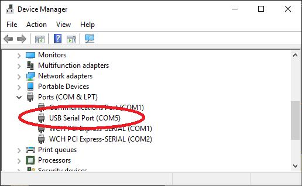
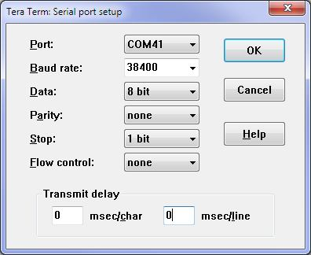

# Serial Console

The serial console is a method of connecting your desktop or laptop computer to the Raspberry Pi Pico and the
MMBasic console. With access to the console you can enter and edit programs, run them, etc. Most versions
of the firmware will automatically create the serial console as a virtual serial port over USB and this chapter
describes how that works and how to use it.

For a self contained computer (described above) the serial console is a secondary communications method but
when you are using the Raspberry Pi Pico as an embedded controller it is the only communications method
available, so it is important that you can connect to it.

Versions of the PicoMite firmware that support a USB keyboard/mouse cannot create the serial port over USB
so, for this firmware, you should refer to the chapter titled Keyboard/Mouse/Gamepad for the alternative.


## Virtual Serial Port

<div style="float: right; margin-left: 20px;">
  
</div>

The virtual serial port over USB created by the PicoMite firmware uses the CDC (Communication Device
Class) protocol and acts like a normal serial port but operating over USB. Windows 10 and 11 includes a
driver for this but with other operating systems you may need to load a driver (see below).

When you connect the Raspberry Pi Pico’s USB connector
to your desktop or laptop computer (after loading the
PicoMite firmware) the connection will be immediately
made.

You should then note the port number created by your
computer for the virtual serial connection. In Windows
this can be done by starting Device Manager and checking
the "Ports (COM & LPT)" entry for a new COM port as
shown on the right.

<br style="clear:both" />

## Terminal Emulator

You also need a terminal emulator running on your desktop or laptop computer. This is a program that acts like
an old fashioned computer terminal where it will display text received from a remote computer and any key
presses will be sent to the remote computer over the serial link. The terminal emulator that you use should
support VT100 emulation as this is required by the editor built into the PicoMite firmware.

<div style="float: right; margin-left: 20px;">
  
</div>

For Windows users it is recommended that you use Tera Term
as this has a good VT100 emulator and is known to work with
the XModem protocol which you can use to transfer programs
to and from the PicoMite. Tera Term can be downloaded from:
http://tera-term.en.lo4d.com .

The screen shot on the right shows the setup for Tera Term. Note
that the "Port:" setting will vary depending on which USB port
your Raspberry Pi Pico was plugged into.

The PicoMite firmware will ignore the baud rate setting so it can
be set to any speed (other than 1200 baud which puts the Pico
into firmware upgrade mode).

If you are using Tera Term do not set a delay between
characters and if you are using Putty set the backspace key to
generate the backspace character.

<br style="clear:both" />

## The Console

Once you have identified the virtual serial port and
have connected your terminal emulator to it, you
should be able to press return on your keyboard and
see the MMBasic prompt, which is the greater than
symbol (eg, `>`).

This is the console and you use it to issue
commands to configure MMBasic, load the BASIC
program, edit and run it. MMBasic also uses the
console to display any error messages.

## Windows 7 and 8.1

The USB serial port uses the CDC protocol and the drivers for this are standard in Windows 10 and 11 and will
load automatically.

The Raspberry Pi Foundation lists Windows 7 or 8.1 as “unsupported” however you can use a tool like Zadig
( https://zadig.akeo.ie ) to install a generic driver for a “usbser” device and that should allow these computers to connect.

This post describes the process: https://github.com/raspberrypi/pico-feedback/issues/118

## Apple Macintosh

The Apple Macintosh (OS X) is somewhat easier as it has the device driver and terminal emulator built in.

First start the application ‘Terminal’ and at the prompt list the connected serial devices by typing in:
```sh
ls /dev/tty.*.
```

The USB to serial converter will be listed as something like /dev/tty.usbmodem12345. While still at the
Terminal prompt you can run the terminal emulator at 115200 baud by using the command:
screen

```sh
/dev/tty.usbmodem12345 115200
```

By default the function keys will not be correctly defined for use in the PicoMite's built in program editor so
you will have to use the control sequences as defined in the chapter Full Screen Editor of this manual. To
avoid this you can configure the terminal emulator to generate these codes when the appropriate function keys
are pressed.

Documentation for the screen command is here: https://www.systutorials.com/docs/linux/man/1-screen/

## Linux

For Linux see these posts:
- https://www.thebackshed.com/forum/ViewTopic.php?TID=14157&PID=175474#175474#175466
- https://www.thebackshed.com/forum/ViewTopic.php?FID=16&TID=16312&LastEntry=Y#213664#213594

## Android

For Android devices see this post:
- https://www.thebackshed.com/forum/ViewTopic.php?FID=16&TID=17476&LastEntry=Y#230521#230517
