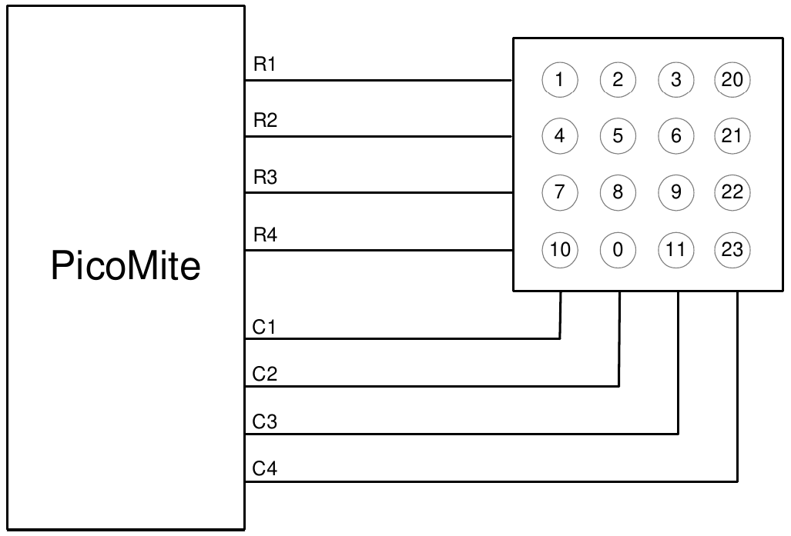

# Special Device Support

To make it easier for a program to interact with the external world the PicoMite firmware includes drivers for a number of common peripheral devices.

These are:
* Infrared remote control receiver and transmitter
* The DS18B20 temperature sensor and DHT22 temperature/humidity sensor
* LCD display modules
* Numeric keypads
* Battery backed clock
* Ultrasonic distance sensor
* WS2812 RGB LEDs

## Infrared Remote Control Decoder

You can easily add a remote control to your project using the IR command. When enabled this function will run in the background and interrupt the running program whenever a key is pressed on the IR remote control.

It will work with any NEC or Sony compatible remote controls including ones that generate extended IR Receiver messages. Most cheap programmable remote controls will generate either protocol and using one of these you 3.3V can add a sophisticated flair to your Pico based project.

The NEC protocol is also used by many other PicoMite manufacturers including Apple, Pioneer, Sanyo, Akai and Toshiba so their branded remotes can be used.

To detect the IR signal you need an IR receiver. NEC remotes use a 38kHz modulation of the IR signal and suitable receivers tuned to this frequency include the Vishay TSOP4838, Jaycar ZD1952 and Altronics Z1611A. Note that the I/O pins on the Raspberry Pi Pico are only 3.3V tolerant and so the receiver must be powered by a maximum of 3.3V. The Raspberry Pi Pico 2 is different and can withstand 5V.

Sony remotes use a 40 kHz modulation but receivers for this frequency can be hard to find. Generally 38 kHz receivers will work but maximum sensitivity will be achieved with a 40 kHz receiver.

The IR receiver can be connected to any pin on the Raspberry Pi Pico. This pin must be configured by the program using the command `SETPIN n, IR` where `n` is the I/O pin to use for this function.

To setup the decoder you use the command `IR dev, key, interrupt`. Where `dev` is a variable that will be updated with the device code and `key` is the variable to be updated with the key code. `interrupt` is the interrupt subroutine to call when a new key press has been detected. The IR decoding is done in the background and the program will continue after this command without interruption.

This is an example of using the IR decoder connected to the GP6 pin:

```basic
SETPIN GP6, IR               ' define the pin to be used
DIM INTEGER DevCode, KeyCode ' variables used by the decoder 
IR DevCode, KeyCode, IRInt   ' start the IR decoder 
DO
  ' < body of the program >
LOOP

SUB IRInt                    ' a key press has been detected
  PRINT "Received device = " DevCode " key = " KeyCode
END SUB
```

IR remote controls can address many different devices (VCR, TV, etc) so the program would normally examine the device code first to determine if the signal was intended for the program and, if it was, then take action based on the key pressed. There are many different devices and key codes so the best method of determining what codes your remote generates is to use the above program to discover the codes.

## Infrared Remote Control Transmitter
<div style="float: right; margin-left: 20px;">
  
</div>

Using the IR SEND command you can transmit a 12 bit Sony infrared remote control signal. This is intended for Raspberry Pi Pico to Raspberry Pi Pico or Micromite communications but it will also work with Sony equipment that uses 12 bit codes. Note that all Sony products require that the message be sent three times with a 26 ms delay between each message.

The circuit on the right illustrates what is required. The transistor is used to drive the infrared LED because the output capability of the Raspberry Pi Pico is limited. This circuit provides about 50 mA to the LED.

To send a signal you use the command `IR SEND pin, dev, key`

Where pin is the I/O pin used, dev is the device code to send and key is the key code. Any I/O pin on the Raspberry Pi Pico can be used and you do not have to set it up beforehand (IR SEND will automatically do that).

The modulation frequency used is 38 kHz and this matches the common IR receivers (described in the previous page) for maximum sensitivity when communicating between two Raspberry Pi Picos or with a Micromite.<br style="clear:both" />

## Measuring Temperature

<div style="float: right; margin-left: 20px;">
  <br>
  
</div>

The TEMPR() function will get the temperature from a DS18B20 3.3V temperature sensor. This device can be purchased on eBay for about 4.7K US$5 in a variety of packages including a waterproof probe version.

The DS18B20 can be powered separately by a 3.3V supply or it can Any PicoMite operate on parasitic power from the Raspberry Pi Pico as shown on the I/O Pin right. Multiple sensors can be used but a separate I/O pin and a 4.7K pullup resistor is required for each one.

Normal Power To get the current temperature you just use the TEMPR() function in an expression. For example, `PRINT "Temperature: " TEMPR(pin)`

Where `pin` is the I/O pin to which the sensor is connected. You do not have to configure the I/O pin, that is handled by MMBasic.

3.3V The returned value is in degrees C with a resolution of 0.25 ºC and is 4.7K accurate to ±0.5 ºC. If there is an error during the measurement the returned value will be 1000.

Any PicoMite The time required for the overall measurement is 200ms and the running I/O Pin program will halt for this period while the measurement is being made.

This also means that interrupts will be disabled for this period. If you do Parasitic Power not want this you can separately trigger the conversion using the TEMPR START command then later use the TEMPR() function to retrieve the temperature reading. The TEMPR() function will always wait if the sensor is still making the measurement.<br style="clear:both" />

For example:
```basic
TEMPR START GP15
< do other tasks >
PRINT "Temperature: " TEMPR(GP15)
```

The TEMPR START command can also be used to change the resolution of the measurement (from the default 0.25 ºC) and the associated conversion time.

## Measuring Humidity and Temperature

<div style="float: right; margin-left: 20px;">
  <br>
</div>

The HUMID command will read the humidity and temperature from a DHT22 humidity/temperature sensor. This device is also sold as the RHT03 or AM2302 but all are compatible and can be purchased on eBay for under $5. The DHT11 sensor is also supported.

The DHT22 must be powered from 3.3V (or up to 5V with the Raspberry Pi Pico 2) and it should have a pullup resistor on the data line as shown. This is suitable for long cable runs (up to 20 meters) but for short runs the resistor can be omitted as the PicoMite firmware also provides an internal weak pullup.


3.3V

4.7K Any PicoMite I/O Pin

To get the temperature or humidity you use the HUMID command with three arguments as follows:
HUMID pin, tVar, hVar [,DHT11]

Where `pin` is the I/O pin to which the sensor is connected. The I/O pin will be automatically configured by MMBasic.

`tVar` is a floating point variable in which the temperature is returned and `hVar` is a second variable for the humidity. The temperature is returned as degrees C with a resolution of one decimal place (eg, 23.4) and the humidity is returned as a percentage relative humidity (eg, 54.3).

If the optional `DHT11` parameter is set to 1 then the command will use device timings suitable for that device.

In this case the results will be returned with a resolution of 1 degree and 1% humidity This example demonstrates using the DHT22 to display the current temperature and humidity every second:

```basic
DIM FLOAT temp, humidity
DO
  HUMID GP15, temp, humidity
  PRINT "The temperature is" temp " and the humidity is" humidity
  PAUSE 1000 
LOOP
```
<br style="clear:both" />

## Real Time Clock Interface

Using the RTC GETTIME command it is easy to get the current time from a PCF8563, DS1307, DS3231 or DS3232 real time clock as well as compatible devices such as the M41T11. These integrated circuits are popular and cheap, will keep accurate time even with the power removed and can be purchased for US$2 to $8 on eBay. Complete modules including the battery can also be purchased on eBay for a little more.

The PCF8563 and DS1307 will keep time to within a minute or two over a month while the DS3231 and DS3232 are particularly precise and will remain accurate to within a minute over a year.

These chips are I²C devices and should be connected to the I²C I/O pins of the Raspberry Pi Pico.

Internal pullup resistors (100KΩ) are applied to the I²C I/O pins so, in many cases external resistors are not needed.

In order to enable the RTC you first need to allocate the I²C pins to be used using the command `OPTION SYSTEM I2C SDApin, SCLpin`

The time used by the RTC must also be set. That is done with the RTC SETTIME command which uses the format `RTC SETTIME year, month, day, hour, minute, second` (Note that the hour must be in 24 hour format).

For example, the following will set the real time clock to 4PM on the 10th November 2025:

```basic
RTC SETTIME 2025, 11, 10, 16, 0, 0 
```

To get the time you use the RTC GETTIME command which will read the time from the real time clock chip and set the clock inside the Raspberry Pi Pico. Normally this command will be placed at the beginning of the program or in the subroutine MM.STARTUP so that the time is set on power up.

The command OPTION RTC AUTO ENABLE can also be used to set an automatic update of the TIME$ and DATE$ read only variables from the real time clock chip on boot and every hour.


## Measuring Distance

<div style="float: right; margin-left: 20px;">
  <br>
</div>

Using a HC-SR04 ultrasonic sensor and the DISTANCE() function you can measure the distance to a target.

This device can be found on eBay for about US$4 and it will measure the distance to a target from 3cm to 3m. It works by sending an ultrasonic sound pulse and measuring the time it takes for the echo to be returned.

Compatible sensors are the SRF05, SRF06, Parallax PING and the DYPME007 (which is waterproof and therefore good for monitoring the level of a water tank). Others that have been reported as working well use the CS100 chip - such as the HC-SR04 and US-025.

In the PicoMite firmware you use the DISTANCE function as follows:

```basic
d = DISTANCE(trig, echo)
```

The value returned is the distance in centimetres to the target.

Where trig is the I/O pin connected to the "trig" input of the sensor and echo is the pin connected the "echo" output of the sensor. You can also use 3-pin devices and in that case only one pin number is specified.

Note that the maximum voltage on all the Raspberry Pi Pico’s I/O pins is 3.3V. Level shifting will be required for this sensor because it uses 5V levels for its echo output. The Raspberry Pi Pico 2 can tolerate 5V (while powered) so, in this case, level shifting is not required.<br style="clear:both" />


## LCD Display

<div style="float: right; margin-left: 20px;">
  <br>
</div>


The LCD command will display text on a standard LCD module with the minimum of programming effort.

This command will work with LCD modules that use the KS0066, HD44780 or SPLC780 controller chip and have 1, 2 or 4 lines. Typical displays include the LCD16X2 (futurlec.com), the Z7001 (altronics.com.au) and the QP5512 (jaycar.com.au). eBay is another good source where prices can range from $10 to $50.

To setup the display you use the DEVICE LCD INIT command `LCD INIT d4, d5, d6, d7, rs, en`

`d4`, `d5`, `d6` and `d7` are the numbers of the I/O pins that connect to inputs D4, D5, D6 and D7 on the LCD module (inputs D0 to D3 and R/W on the module should be connected to ground). `rs` is the pin connected to the register select input on the module (sometimes called CMD or DAT). `en` is the pin connected to the enable or chip select input on the module.

Any I/O pins on the Raspberry Pi Pico can be used and you do not have to set them up beforehand (the LCD command automatically does that for you). The following shows a typical set up.

<div style="clear: both; margin: .5em 15%;">

</div>

To display characters on the module you use the LCD command
`LCD line, pos, data$`

Where `line` is the line on the display (1 to 4) and `pos` is the position on the line where the data is to be written (the first position on the line is 1). `data$` is a string containing the data to write to the LCD display.

The characters in `data$` will overwrite whatever was on that part of the LCD.

The following shows a typical usage where d4 to d7 are connected to pins GP2 to GP5, rs is connected to pin GP6 and en to pin GP7.

```basic
LCD INIT GP2, GP3, GP4, GP5, GP6, GP7
LCD 1, 2, "Temperature"
LCD 2, 6, STR$(TEMPR(GP15)) ' DS18B20 connected to pin GP15
```

Note that this example also uses the TEMPR() function to get the temperature (described above).


## Keypad Interface

A keypad is a low tech but effective method of entering numeric data. The PicoMite firmware supports either a 4x3 keypad or a 4x4 keypad and the monitoring and decoding of key presses is done in the background. When a key press is detected an interrupt will be issued where the program can deal with it.

Examples of a 4x3 keypad and a 4x4 keypad are the Altronics S5381 and S5383 (go to https://www.altronics.com ).

To enable the keypad feature you use the command `KEYPAD var, int, r1, r2, r3, r4, c1, c2, c3, c4`

Where `var` is a variable that will be updated with the key code and `int` is the name of the interrupt subroutine to call when a new key press has been detected. `r1`, `r2`, `r3` and `r4` are the pin numbers used for the four row connections to the keypad (see the diagram below) and `c1`, `c2`, `c3` and `c4` are the column connections. `c4` is only used with 4x4 keypads and should be omitted if you are using a 4x3 keypad.

Any I/O pins on the Raspberry Pi Pico can be used and you do not have to set them up beforehand, the KEYPAD command will automatically do that for you.

<div style="clear: both; margin: .5em 25%;">

</div>

The detection and decoding of key presses is done in the background and the program will continue after this command without interruption. When a key press is detected the value of the variable var will be set to the number representing the key (this is the number inside the circles in the diagram above). Then the interrupt will be called.

For example:
```basic
Keypad KeyCode,KP_Int,GP2,GP3,GP4,GP5,GP6,GP7,GP8 ' 4x3 keybd
DO
< body of the program >
LOOP

SUB KP_Int           ' run when a key press has been detected
  PRINT "Key press = " KeyCode  
END SUB
```


## WS2812 multicolour LED

The PicoMite firmware has built in support for the WS2812 multicolour LED chip. This chip needs a very specific timing to work properly and with the DEVICE WS2812 command it is easy to control these devices with minimal effort.

This command will output the required signals needed to drive a chain of WS2812 LED chips connected to the pin specified and set the colours of each LED in the chain. The syntax of the command is:
`WS2812 type, pin, nbr%, colours%[()]`

Note that the pin must be set to a digital output before this command is used. The colours%() array should be sized to have at least the same number of elements as the number of LEDs to be driven (nbr%). Each element in the array should contain the colour in the normal RGB888 format (0 - HFFFFFF). Where a single LED is to be driven then colours% should be a simple variable.

Up to 256 WS2812 chips in a string are supported.

`type` is a single character specifying the type of chip being driven as follows:
- `O` = original WS2812
- `B` = WS2812B
- `S` = SK6812 
- `W` = SK6812W (RGBW)

As an example:

```basic
DIM b%(4)=(RGB(red), Rgb(green), RGB(blue), RGB(Yellow), rgb(cyan))
SETPIN GP5, DOUT
WS2812 O, GP5, 5, b%()
```

will output the specified colours to an array of five WS2812 LEDs daisy chained off pin GP5.

It is possible that a WS2812 will not work reliably with the 3.3V output from the Raspberry Pi Pico. In this case there are a number of solutions:

* Use the WS2812B which will work with a 3.3V supply and inputs.
* Use the Raspberry Pi Pico 2 which can tolerate 5V (while powered) so, in this case, level shifting is not required..
* Use a single WS2812 powered from 3.3V as a first stage to buffer the input of the first "real" LED in the string.<br>
The minimum supply for the WS2812 is 4V but in many cases it will work at 3.3V.


## OV7670 Camera module

The PicoMite firmware has support for a OV7670 camera module. See the [CAMERA command](command/camera.md) for details
