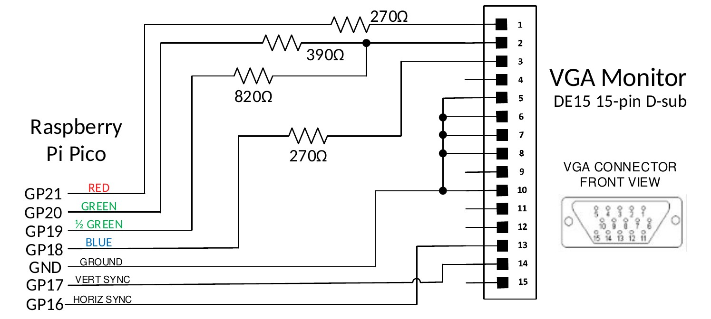
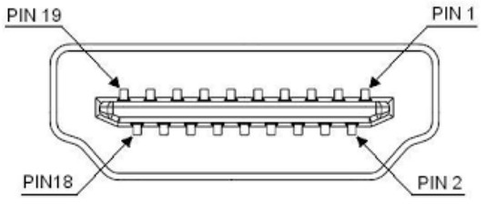
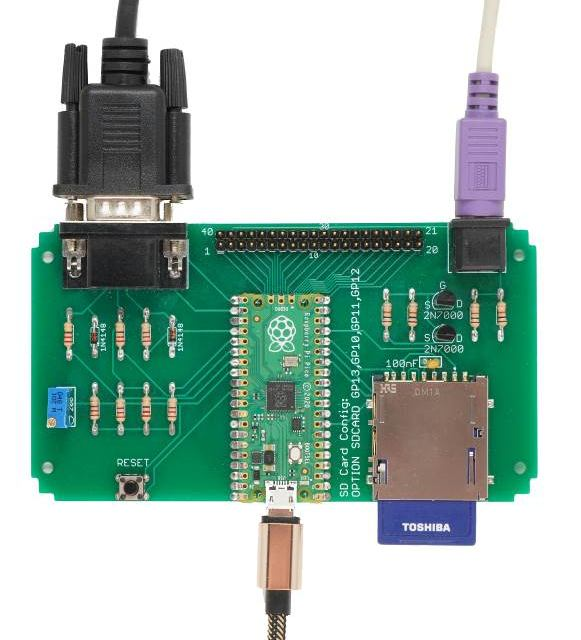
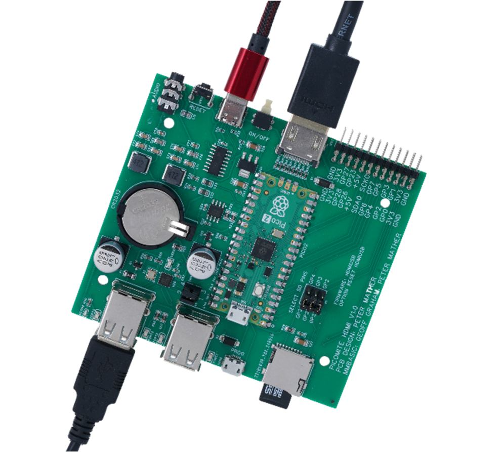

# Video Output


## VGA Video

For versions of the firmware that support a VGA video output the following diagram illustrates how to attach
such a monitor. The VGA output is automatically enabled at startup – there are no options that need to be set.

<div style="clear: both; margin: .5em;">
  
</div>

Raspberry<br>Pi Pico | Signal | Resistor | VGA Monitor<br>DE15 15-pin D-sub
:-: | :-: | :-: | :-
GP21 | RED | 270Ω | 1
GP20 | GREEN | 390Ω | 2
GP19 | ½ GREEN | 820Ω | 2
GP18 | BLUE | 270Ω | 3
GND | GROUND | | 5, 6, 7, 8, 10
GP17 | VERT SYNC | | 14
GP16 | HORIZ SYNC | | 13

The output is in the standard VGA format with a pixel rate of 25.175MHz and a frame rate of 60Hz.
There are two or three modes which can be selected using the MODE command:

- MODE 1 Monochrome with a resolution of 640 x 480 (default at startup)
- MODE 2 16 colours with a resolution of 320 x 240
- MODE 3 16 colours with a resolution of 640 x 480 (RP2350 only)

In MODE 2 and 3 the output is 16 colours in the 4-bit RGB121 format (i.e. 1 bit for red, 2 bits for green, and 1
bit for blue). In MODE 2 the pixels are duplicated along both the x and y axis giving a 320 x 240 resolution
while the monitor still sees a 640 x 480 signal.

The output from MMBasic is written as a bitmap to a framebuffer. The firmware then uses the second CPU in
the processor to feed this framebuffer data, a pixel line at a time, via DMA to one of the RP2040’s
programmable I/O controllers (PIO0) to generate the display. As this runs independently of the main processor
there is little or no impact on the speed of MMBasic caused by generating the VGA output.


## HDMI Video

<div style="float: right; margin-left: 20px;">
  
  <div style="text-align:center">HDMI Front View</div>
</div>

For versions of the firmware that support HDMI video the following table lists the connections to the standard
HDMI Type A socket. The HDMI output is automatically enabled at startup – there are no options that need to be set.

<br style="clear:both" />

HDMI Pin | Raspberry Pico Pin
 :-: | :-
1 | Pin 21 (GP16) via a 220Ω resistor
2 | Ground
3 | Pin 22 (GP17) via a 220Ω resistor
4 | Pin 24 (GP18) via a 220Ω resistor
5 | Ground
6 | Pin 25 (GP19 via a 220Ω resistor
7 | Pin 16 (GP12) via a 220Ω resistor
8 | Ground
9 | Pin 17 (GP13) via a 220Ω resistor
10 | Pin 19 (GP14) via a 220Ω resistor
11 | Ground
12 | Pin 20 (GP15) via a 220Ω resistor
13 | 
14 | 
15 | 
16 | 
17 | Ground
18 | +5V via Schottky barrier diode
19 | 

The HDMI signal pins are driven at a high frequency and for this reason care should be taken as follows:
* Keep the signal traces as short as possible.
* Make sure that all signal traces are the same length.
* The 220Ω resistor should preferably be a surface mount type.

To generate the DVI/HDMI signal the firmware needs to overclock the RP2350 to as high as 372MHz and most
Raspberry Pi Pico 2 modules will not have any trouble at these speeds. However, this cannot be guaranteed,
especially with third party modules. An example is the Pimoroni Pico Plus 2 which is marginal at the required
speeds and therefore cannot be recommended with the HDMI versions of the PicoMite firmware.

Similar to how VGA is generated, the output of MMBasic is written to a framebuffer which, using the second
CPU and DMA, is fed to the HSTX peripheral which in turn generates the parallel video data. The video
signal produced is actually DVI (HDMI supports DVI) so this means that audio is not supported on the HDMI
output and sophisticated HDMI features such as High Definition Content Protection (HDCP) and Ethernet are
also not supported.

HDMI video supports a number of resolutions. To set these you use the following command:
```basic
OPTION RESOLUTION nn
```

Where `nn` is one of:
- `640x480` or `640`
- `1280x720` or `1280`
- `1024x768` or `1024`
- `800x600` or `800`
- `720x400` or `720`
- `848x480` or `848`

Each HDMI resolution can operate in a number of modes which are set using the MODE command. Note that
many modes reduce the displayed resolution to save memory for other features, this reduction is done by
doubling or quadrupling each pixel, however the monitor will always see the resolution (ie, pixel density) set
by the `OPTION RESOLUTION` command. The default is `RESOLUTION 640x480` and `MODE 1`

## Reference Designs

### VGA/PS2 Reference Design (Raspberry Pi Pico)

<div style="float: right; margin-left: 20px;">
  
</div>

This is an easy to assemble design that implements the VGA
output, PS2 keyboard interface and the SD Card socket (this
design was featured in Silicon Chip magazine).

It uses common thru-hole components and can be assembled in
under an hour.

All 40 pins on the Raspberry Pi Pico are routed to a 40-way
connector on the rear of the PCB in the same configuration as
that used by the Pico. This makes it easy to connect external
devices as you can consult the pin out diagram in this manual
and then select the corresponding pins on the 40-way connector.

Allowing for the I/O pins reserved for the VGA output,
keyboard and SD Card there are 14 I/O pins available for
external circuitry.

The board is sized to fit in an Altronics snap-together case 130 &times; 75 &times; 28mm (part number H0376).

<br style="clear:both" />

The construction pack for this design can be downloaded from:
https://geoffg.net/picomitevga.html (at the bottom of the page).


### HDMI/USB Reference Design (Raspberry Pi Pico 2)

<div style="float: right; margin-left: 20px;">
  
</div>

This is a full featured design based on the Raspberry Pi Pico 2
(using the RP2350 processors) which includes:
* HDMI video output
* Four USB interfaces for keyboard, mouse, game pad, etc.
* High quality audio output for amplified speakers.
* USB interface to the serial console.
* Battery backed real-time clock.
* Micro SD card socket.
* 14 I/O pins made available on the rear panel.
* Sized to fit a Multicomp MCRM2015S or Hammond RM2015S enclosure.

<br style="clear:both" />

The construction pack for this design can be downloaded from 
https://geoffg.net/picomitevga.html (at the bottom of the page).

